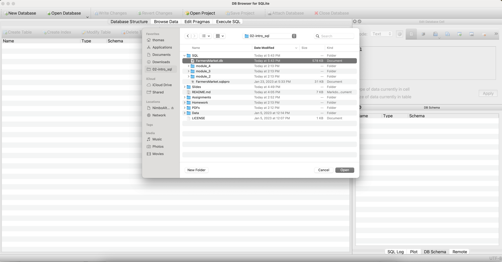
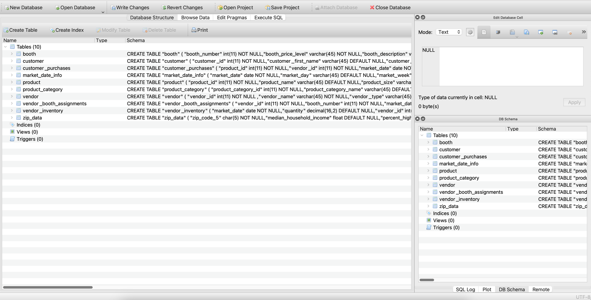
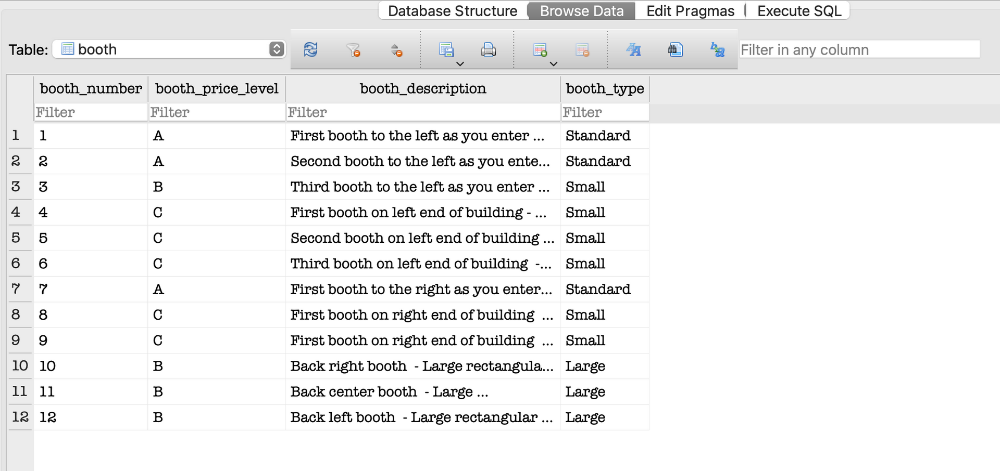
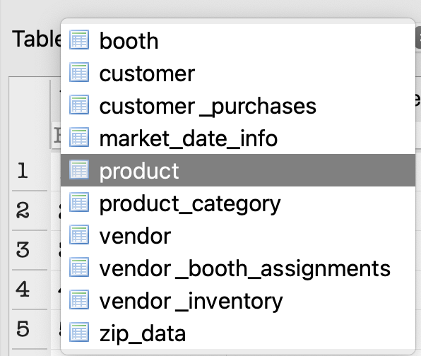
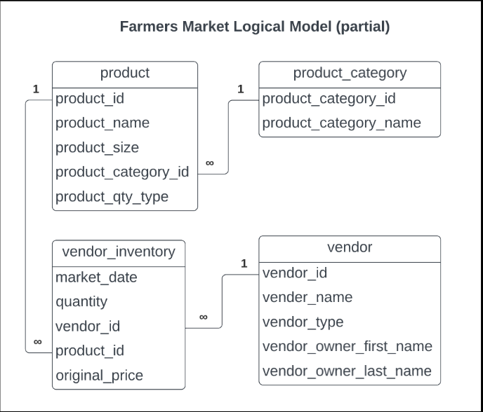
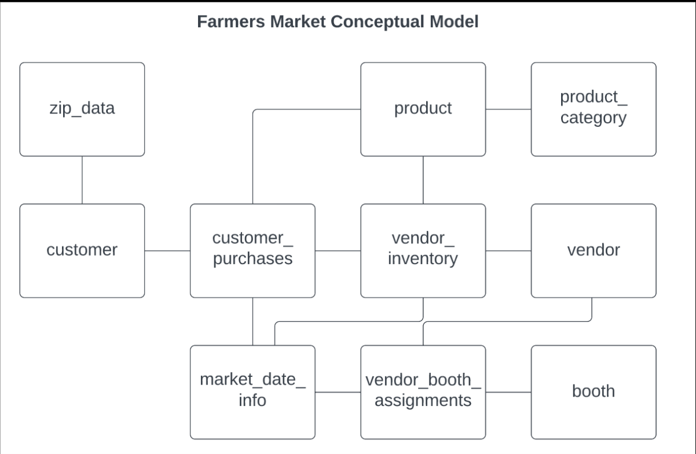

# Assignment 1: Meet the farmersmarket.db and Basic SQL

🚨 **Please review our [Assignment Submission Guide](https://github.com/UofT-DSI/onboarding/blob/main/onboarding_documents/submissions.md)** 🚨 for detailed instructions on how to format, branch, and submit your work. Following these guidelines is crucial for your submissions to be evaluated correctly.

#### Submission Parameters:
* Submission Due Date: `January 25, 2025`
* Weight: 30% of total grade
* The branch name for your repo should be: `assignment-one`
* What to submit for this assignment:
    * This markdown (Assignment1.md) with written responses in Section 4
    * One Entity-Relationship Diagram (preferably in a pdf, jpeg, png format).
    * One .sql file 
* What the pull request link should look like for this assignment: `https://github.com/<your_github_username>/sql/pulls/<pr_id>`
    * Open a private window in your browser. Copy and paste the link to your pull request into the address bar. Make sure you can see your pull request properly. This helps the technical facilitator and learning support staff review your submission easily.

Checklist:
- [x] Create a branch called `assignment-one`.
- [x] Ensure that the repository is public.
- [x] Review [the PR description guidelines](https://github.com/UofT-DSI/onboarding/blob/main/onboarding_documents/submissions.md#guidelines-for-pull-request-descriptions) and adhere to them.
- [x] Verify that the link is accessible in a private browser window.

If you encounter any difficulties or have questions, please don't hesitate to reach out to our team via our Slack. Our Technical Facilitators and Learning Support staff are here to help you navigate any challenges.

*** 

## Section 1:
You can start this section following *session 1*.

Steps to complete this part of the assignment:
- Load the farmersmarket.db and browse its content
- Create a logical data model

<br>
If this is your first time in DB Browser for SQLite, the following instructions may help:

#### 1) Load Database
- Open DB Browser for SQLite
- Go to File > Open Database
- Navigate to your farmersmarket.db 
	- This will be wherever you cloned the GH Repo (within the **SQL** folder)
	- 

#### 2) Configure your windows
By default, DB Browser for SQLite has three windows, with four tabs in the main window and three tabs in the bottom right window
- Window 1: Main Window (Centre)
	- Stay in the Database Structure tab for now
- Window 2: Edit Database Cell (Top Right)
- Window 3: Remote (Bottom Right)
	- Switch this to DB Schema tab (very bottom)

Your screen should look like this (or very similar)


#### 3) The farmersmarket.db
There are 10 tables in the Main Window:
1) booth
2) customer
3) customer_purchases
4) market_date_info
5) product
6) product_category
7) vendor
8) vendor_booth_assignments
9) vendor_inventory
10) zip_data

Switch to the Browse Data tab, booth is selected by default




Using the table drop down at the top left, explore some of the contents of the database



Move on to the Logical Data Model task when you have looked through the tables


### Build Logical Data Model

Recall during session 1:

I diagramed the following four tables:
- product
- product_category
- vendor
- vendor_inventory

 


#### Prompt 1:
Choose two tables and create a logical data model. There are lots of tools you can do this (including drawing this by hand), but I'd recommend [Draw.io](https://www.drawio.com/) or [LucidChart](https://www.lucidchart.com/pages/). 

A logical data model must contain:
- table name
- column names
- relationship type

Please do not pick the exact same tables that I have already diagrammed. For example, you shouldn't diagram the relationship between `product` and `product_category`, but you could diagram `product` and `customer_purchases`.

**HINTS**:
- You will need to use the Browse Data tab in the main window to figure out the relationship types.
- You can't diagram tables that don't share a common column
	- These are the tables that are connected
	- 
- The column names can be found in a few spots (DB Schema window in the bottom right, the Database Structure tab in the main window by expanding each table entry, at the top of the Browse Data tab in the main window)

***

## Section 2:
You can start this section following *session 2*.

Steps to complete this part of the assignment:
- Open the assignment1.sql file in DB Browser for SQLite:
	- from [Github](./02_activities/assignments/assignment1.sql)
	- or, from your local forked repository  
- Complete each question

### Write SQL

#### SELECT
1. Write a query that returns everything in the customer table.
2. Write a query that displays all of the columns and 10 rows from the customer table, sorted by customer_last_name, then customer_first_ name.

<div align="center">-</div>

#### WHERE
1. Write a query that returns all customer purchases of product IDs 4 and 9.
2. Write a query that returns all customer purchases and a new calculated column 'price' (quantity * cost_to_customer_per_qty), filtered by vendor IDs between 8 and 10 (inclusive) using either:
	1.  two conditions using AND
	2.  one condition using BETWEEN

<div align="center">-</div>

#### CASE
1. Products can be sold by the individual unit or by bulk measures like lbs. or oz. Using the product table, write a query that outputs the `product_id` and `product_name` columns and add a column called `prod_qty_type_condensed` that displays the word “unit” if the `product_qty_type` is “unit,” and otherwise displays the word “bulk.”

2. We want to flag all of the different types of pepper products that are sold at the market. Add a column to the previous query called `pepper_flag` that outputs a 1 if the product_name contains the word “pepper” (regardless of capitalization), and otherwise outputs 0.

<div align="center">-</div>

#### JOIN
1. Write a query that `INNER JOIN`s the `vendor` table to the `vendor_booth_assignments` table on the `vendor_id` field they both have in common, and sorts the result by `vendor_name`, then `market_date`.

***

## Section 3:
You can start this section following *session 3*.

Steps to complete this part of the assignment:
- Open the assignment1.sql file in DB Browser for SQLite:
	- from [Github](./02_activities/assignments/assignment1.sql)
	- or, from your local forked repository  
- Complete each question

### Write SQL

#### AGGREGATE
1. Write a query that determines how many times each vendor has rented a booth at the farmer’s market by counting the vendor booth assignments per `vendor_id`.
2. The Farmer’s Market Customer Appreciation Committee wants to give a bumper sticker to everyone who has ever spent more than $2000 at the market. Write a query that generates a list of customers for them to give stickers to, sorted by last name, then first name.
   
**HINT**: This query requires you to join two tables, use an aggregate function, and use the HAVING keyword.

<div align="center">-</div>

#### Temp Table
1. Insert the original vendor table into a temp.new_vendor and then add a 10th vendor: Thomass Superfood Store, a Fresh Focused store, owned by Thomas Rosenthal
   
**HINT**: This is two total queries -- first create the table from the original, then insert the new 10th vendor. When inserting the new vendor, you need to appropriately align the columns to be inserted (there are five columns to be inserted, I've given you the details, but not the syntax)

To insert the new row use VALUES, specifying the value you want for each column:  
`VALUES(col1,col2,col3,col4,col5)`

<div align="center">-</div>

#### Date
1. Get the customer_id, month, and year (in separate columns) of every purchase in the customer_purchases table.
   
**HINT**: you might need to search for strfrtime modifers sqlite on the web to know what the modifers for month and year are!

2. Using the previous query as a base, determine how much money each customer spent in April 2022. Remember that money spent is `quantity*cost_to_customer_per_qty`.
   
**HINTS**: you will need to AGGREGATE, GROUP BY, and filter...but remember, STRFTIME returns a STRING for your WHERE statement!!

*** 

## Section 4:
You can start this section anytime.

Steps to complete this part of the assignment:
- Read the article
- Write, within this markdown file, <1000 words.

### Ethics

Read: Qadri, R. (2021, November 11). _When Databases Get to Define Family._  Wired. <br>
    https://www.wired.com/story/pakistan-digital-database-family-design/

Link if you encounter a paywall: https://web.archive.org/web/20240422105834/https://www.wired.com/story/pakistan-digital-database-family-design/

**What values systems are embedded in databases and data systems you encounter in your day-to-day life?**

Consider, for example, concepts of fariness, inequality, social structures, marginalization, intersection of technology and society, etc.


```

That was a fascinating read. I am Pakistani, but born and raised in Canada, so it was enlightening to read about. Whenever my mom goes to Pakistan, or wants to bring her kids, she has to file a National Identity Card for Overseas Pakistanis (NICOP) card, which is the CNIC equivalent for those who live overseas and have dual citizenship. Until now, I knew nothing about this process.

Anyways, to answering the question. What value systems are embedded in databases and data systems I encounter in my day-to-day life?

First of all, with respect to biometrics like fingerprints (which our data bases use, particularly for my friends applying for permanent visas), one must first have all their fingers. This sounds a bit silly but it's the first one I thought of.

Another one that comes to mind is the assumption that one has a Facebook or Instagram account. The latter is particularly annoying for me because I don't have Instagram. For those who have "no surf" values or want to become unplugged, it's increasingly harder to "go offline" because so many data collection platforms (particularly surveys) work under the assumption that you have some form of social media, or even that you simply have data available to connect to the internet. These platforms also assume you have an email which...it's a sensible thing to have, sure, but it reflects a society that is becoming increasingly reliant on technology and social media services.

On another note, for the systems I encounter in my clinical research work, a LOT of thought is put into those databases. The main one is privacy, so we encode the ability to associate the participants with an id number and the key to connect the id to patient is only known to a select few people. The double-blinded entries then have less barriers to access for the researchers using them to do the work. 

One main issue we ran into after a recent audit was that, in our inclusion criteria, we said the participant must be "stable". We collected this by getting the doctor overseeing the participant to check a box that said "stable". However, the auditor was not happy with this. They wanted rigorous documentation for the definition of "stable." In the opinion of us researchers, this was a difference of values on the information we included in the database. We valued a lower burden of work for the overseeing doctor, and it was sufficient to trust their interpretation of what contitutes stable for their participant. But auditors in general value being able to meticulously trace even unrelated pieces of information (such as temperature that we store our gas that we use during experiments, which...yes, we were made to collect, even though it has no bearing or effect on anything). The debate with these auditors has sometimes required that we completely overhaul aspects of our database, rather than simply adding a category, meaning that the researcher vs auditor values would impact the organization of the database.  

Within this work, one thing I noticed was that the entry in our database marked for "ethnicity" was not a large enough category. I am Pakistani, i.e. South Asian, but this database would consider me "Caucasian" because the field was simply not diverse enough. This likely occurred because cystic fibrosis, which is the disease I work with, is most common in Caucasians, with some prevalence in East Asians and Black/African individuals. So they hard-coded these ethicities in. There was an assumption that the genetic anomaly resulting in cystic fibrosis does not occur in other populations, which is not the best practice for organizing the database and could result in South Asians not having their needs appropriately met if their paperwork calls them Caucasian.

On the note of diversity and intersecionalism, I think our society (Canada...USA out here trying to reverse it) generally does a better job of including these in databases in recent times. I notice more databases contain entries asking for pronouns, sex and gender with more categories, but also gives the option not to answer for those who do not want to (so accounting for all political beliefs across the spectrum). There's more considerations for people with disabilities, accessibility needs and Indigenous populations. I also appreciate the inclusion of a dietary restrictions category for conferences, and doubly so when it includes halal (I am Muslim). You can really feel that diversity and inclusion (DEI) values are being considered in the creation of databases in Canada. 

Above, I  have covered a few values: Implied abelism, intersection of technology and society, ethics in clinical studies, value differences on how much attention to detail is sufficient, and various comments on DEI principles. While a bit more disjointed of an "essay"-like response than I would like (reading more like a stream-of-consciousness honestly), I hope you found the read enjoyable. Thanks!

-Faiyza Alam


```
