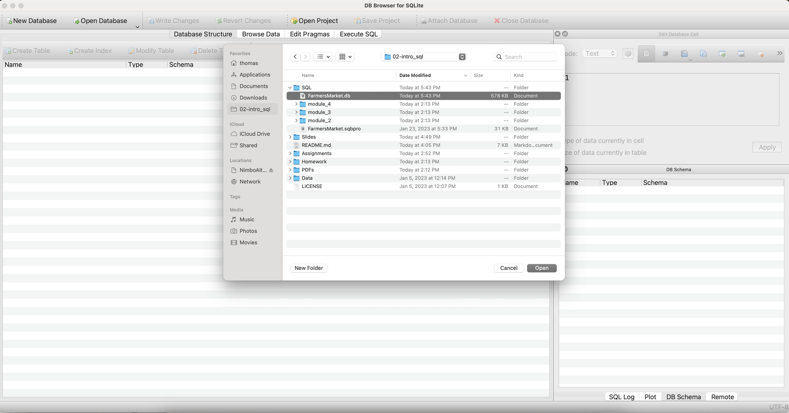
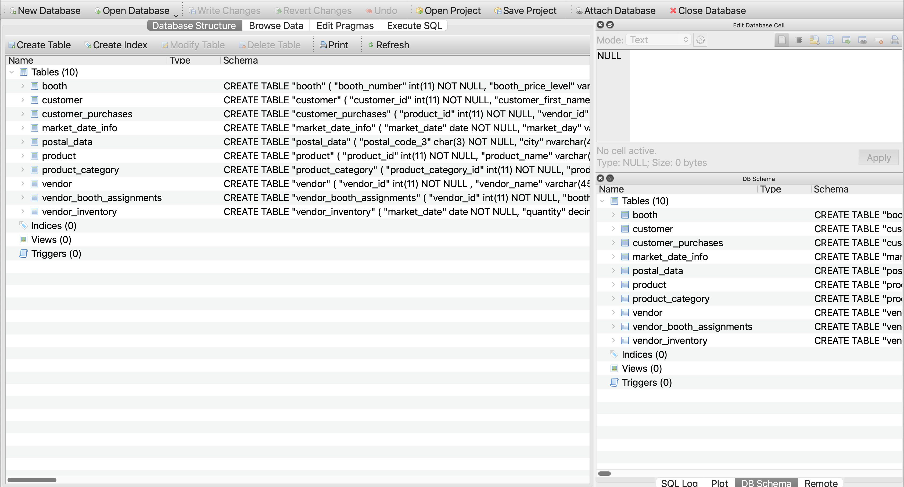
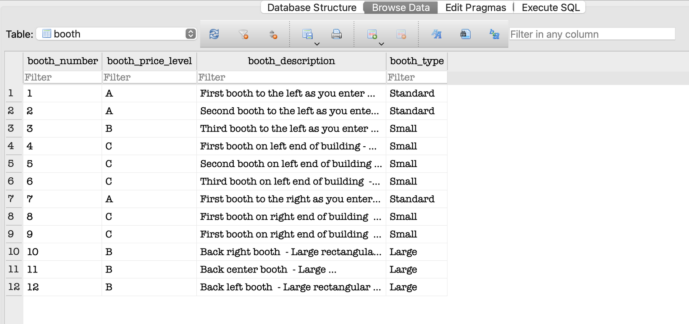
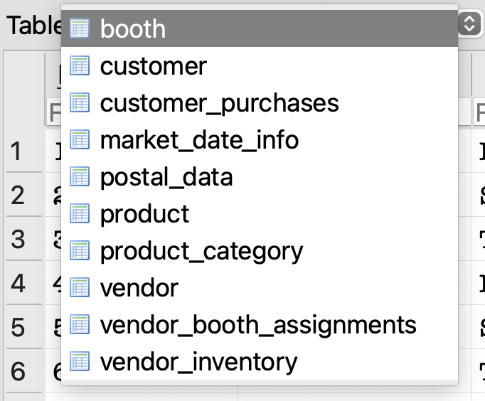
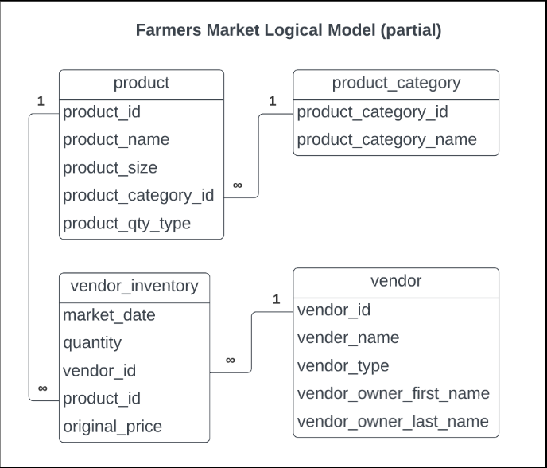
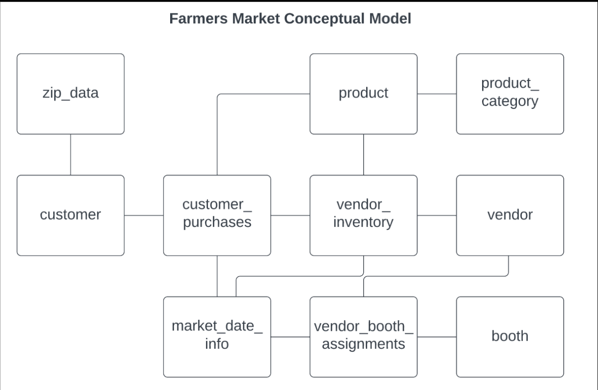

# DC Assignment 1: Meet the farmersmarket.db and Basic SQL

🚨 **Please review our [Assignment Submission Guide](https://github.com/UofT-DSI/onboarding/blob/main/onboarding_documents/submissions.md)** 🚨 for detailed instructions on how to format, branch, and submit your work. Following these guidelines is crucial for your submissions to be evaluated correctly.

#### Submission Parameters:
* Submission Due Date: `March 31, 2026`
* Weight: 30% of total grade
* The branch name for your repo should be: `assignment-one`
* What to submit for this assignment:
    * This markdown (Assignment1.md) with written responses in Section 4
    * One Entity-Relationship Diagram (preferably in a pdf, jpeg, png format).
    * One .sql file 
* What the pull request link should look like for this assignment: `https://github.com/<your_github_username>/sql/pulls/<pr_id>`
    * Open a private window in your browser. Copy and paste the link to your pull request into the address bar. Make sure you can see your pull request properly. This helps the technical facilitator and learning support staff review your submission easily.

Checklist:
- [ ] Create a branch called `assignment-one`.
- [ ] Ensure that the repository is public.
- [ ] Review [the PR description guidelines](https://github.com/UofT-DSI/onboarding/blob/main/onboarding_documents/submissions.md#guidelines-for-pull-request-descriptions) and adhere to them.
- [ ] Verify that the link is accessible in a private browser window.

If you encounter any difficulties or have questions, please don't hesitate to reach out to our team via our Slack. Our Technical Facilitators and Learning Support staff are here to help you navigate any challenges.

*** 

## Section 1:
You can start this section following *session 1*.

Steps to complete this part of the assignment:
- Load the farmersmarket.db and browse its content
- Create a logical data model

<br>
If this is your first time in DB Browser for SQLite, the following instructions may help:

#### 1) Load Database
- Open DB Browser for SQLite
- Go to File > Open Database
- Navigate to your farmersmarket.db 
	- This will be wherever you cloned the GH Repo (within the **05_src/sql** folder)
	- 

#### 2) Configure your windows
By default, DB Browser for SQLite has three windows, with four tabs in the main window and three tabs in the bottom right window
- Window 1: Main Window (Centre)
	- Stay in the Database Structure tab for now
- Window 2: Edit Database Cell (Top Right)
- Window 3: Remote (Bottom Right)
	- Switch this to DB Schema tab (very bottom)

Your screen should look like this (or very similar)


#### 3) The farmersmarket.db
There are 10 tables in the Main Window:
1) booth
2) customer
3) customer_purchases
4) market_date_info
5) product
6) product_category
7) vendor
8) vendor_booth_assignments
9) vendor_inventory
10) postal_data

Switch to the Browse Data tab, booth is selected by default




Using the table drop down at the top left, explore some of the contents of the database



Move on to the Logical Data Model task when you have looked through the tables


### Build Logical Data Model

Recall during session 1:

I diagramed the following four tables:
- product
- product_category
- vendor
- vendor_inventory

 


#### Prompt 1:
Choose two tables and create a logical data model. There are lots of tools you can do this (including drawing this by hand), but I'd recommend [Draw.io](https://www.drawio.com/) or [LucidChart](https://www.lucidchart.com/pages/). 

A logical data model must contain:
- table name
- column names
- relationship type

Please do not pick the exact same tables that I have already diagrammed. For example, you shouldn't diagram the relationship between `product` and `product_category`, but you could diagram `product` and `customer_purchases`.

**HINTS**:
- You will need to use the Browse Data tab in the main window to figure out the relationship types.
- You can't diagram tables that don't share a common column
	- These are the tables that are connected
	- 
- The column names can be found in a few spots (DB Schema window in the bottom right, the Database Structure tab in the main window by expanding each table entry, at the top of the Browse Data tab in the main window)

***

## Section 2:
You can start this section following *session 2*.

Steps to complete this part of the assignment:
- Open the assignment1.sql file in DB Browser for SQLite:
	- from [Github](./02_activities/assignments/assignment1.sql)
	- or, from your local forked repository  
- Complete each question, by writing responses between the QUERY # and END QUERY blocks

### Write SQL

#### SELECT
1. Write a query that returns everything in the customer table.
2. Write a query that displays all of the columns and 10 rows from the customer table, sorted by customer_last_name, then customer_first_ name.

<div align="center">-</div>

#### WHERE
1. Write a query that returns all customer purchases of product IDs 4 and 9. Limit to 25 rows of output.
2. Write a query that returns all customer purchases and a new calculated column 'price' (quantity * cost_to_customer_per_qty), filtered by customer IDs between 8 and 10 (inclusive) using either:
	1.  two conditions using AND
	2.  one condition using BETWEEN
Limit to 25 rows of output.

<div align="center">-</div>

#### CASE
1. Products can be sold by the individual unit or by bulk measures like lbs. or oz. Using the product table, write a query that outputs the `product_id` and `product_name` columns and add a column called `prod_qty_type_condensed` that displays the word “unit” if the `product_qty_type` is “unit,” and otherwise displays the word “bulk.”

2. We want to flag all of the different types of pepper products that are sold at the market. Add a column to the previous query called `pepper_flag` that outputs a 1 if the product_name contains the word “pepper” (regardless of capitalization), and otherwise outputs 0.

<div align="center">-</div>

#### JOIN
1. Write a query that `INNER JOIN`s the `vendor` table to the `vendor_booth_assignments` table on the `vendor_id` field they both have in common, and sorts the result by `market_date` then `vendor_name`. Limit to 24 rows of output. 

***

## Section 3:
You can start this section following *session 3*.

Steps to complete this part of the assignment:
- Open the assignment1.sql file in DB Browser for SQLite:
	- from [Github](./02_activities/assignments/assignment1.sql)
	- or, from your local forked repository  
- Complete each question, by writing responses between the QUERY # and END QUERY blocks

### Write SQL

#### AGGREGATE
1. Write a query that determines how many times each vendor has rented a booth at the farmer’s market by counting the vendor booth assignments per `vendor_id`.
2. The Farmer’s Market Customer Appreciation Committee wants to give a bumper sticker to everyone who has ever spent more than $2000 at the market. Write a query that generates a list of customers for them to give stickers to, sorted by last name, then first name.
   
**HINT**: This query requires you to join two tables, use an aggregate function, and use the HAVING keyword.

<div align="center">-</div>

#### Temp Table
1. Insert the original vendor table into a temp.new_vendor and then add a 10th vendor: Thomass Superfood Store, a Fresh Focused store, owned by Thomas Rosenthal
   
**HINT**: This is two total queries -- first create the table from the original, then insert the new 10th vendor. When inserting the new vendor, you need to appropriately align the columns to be inserted (there are five columns to be inserted, I've given you the details, but not the syntax)

To insert the new row use VALUES, specifying the value you want for each column:  
`VALUES(col1,col2,col3,col4,col5)`

<div align="center">-</div>

#### Date
1. Get the customer_id, month, and year (in separate columns) of every purchase in the customer_purchases table.
   
**HINT**: you might need to search for strfrtime modifers sqlite on the web to know what the modifers for month and year are!

Limit to 25 rows of output. 

2. Using the previous query as a base, determine how much money each customer spent in April 2022. Remember that money spent is `quantity*cost_to_customer_per_qty`.
   
**HINTS**: you will need to AGGREGATE, GROUP BY, and filter...but remember, STRFTIME returns a STRING for your WHERE statement...
AND be sure you remove the LIMIT from the previous query before aggregating!! 

*** 

## Section 4:
You can start this section anytime.

Steps to complete this part of the assignment:
- Read the article
- Write, within this markdown file, between 250 and 1000 words. No additional citations/sources are required.

### Ethics

Read: Qadri, R. (2021, November 11). _When Databases Get to Define Family._  Wired. <br>
    https://www.wired.com/story/pakistan-digital-database-family-design/

Link if you encounter a paywall: https://archive.is/srKHV or https://web.archive.org/web/20240422105834/https://www.wired.com/story/pakistan-digital-database-family-design/

**What values systems are embedded in databases and data systems you encounter in your day-to-day life?**

Consider, for example, concepts of fariness, inequality, social structures, marginalization, intersection of technology and society, etc.


```
After reading this article, I realized that databases are much less neutral than I used to think. Normally, I think of a database as just a system for storing information in an organized way. It seems technical and objective. But this article made me think more about how databases are built around human choices. The way a system defines categories such as family, gender, or legal relationship can shape who is recognized and who is left out.

In my daily life, I use many systems that rely on databases, including school portals, banking apps, health records, immigration forms, and social media platforms. Most of the time, I do not pay much attention to how these systems are designed. I just answer the questions they ask. But the article made me realize that even simple fields and drop-down options reflect certain assumptions. A database may ask who counts as a parent, what counts as a household, or what kind of relationship is officially valid. These may seem like practical questions, but they are also social and political ones.

One thing that stood out to me from the article (and this week's assignment) is that databases often prefer neat and fixed categories, while real life is usually more messy and complicated. Families are a good example. In reality, family can include biological relatives, adoptive relatives, step-relatives, caregivers, or other people who play a central role in someone’s life. But a database may only recognize a narrow and formal definition of family. When that happens, the system is not just storing information. It is also deciding which relationships are easy to see and which ones do not fully count.

I also think many data systems in everyday life reflect existing inequalities. People whose lives fit dominant expectations often move through these systems more easily. Their identities, family structures, and documents match what the system expects. But for people whose lives are more complex, the system can become frustrating or even harmful. This can affect immigrants, gender-diverse people, people in nontraditional families, or people whose legal records do not fully reflect their lived reality. In those cases, the problem is not only about individual bias but is also about how the system itself was designed.

Another idea I kept thinking about is that databases often value efficiency over complexity. Institutions do this as they need information to be searchable, sortable, and easy to verify. But making people easier to process can also mean flattening their lives into categories that do not fully fit. A person may have one legal name in a system but use another name in daily life. Someone may have one official address but move between homes. Someone’s most important relationships may not be the ones that a system is built to recognize. These examples show how the desire for administrative order can come at the cost of accurately representing people’s lives.

On the other hand, however, I do not think the answer is to reject databases completely. They are necessary for many services and institutions to function. What this article changed for me is the way I think about them. I no longer see databases as only technical systems. They are also social systems that reflect values. The decision about what categories exist, what relationships matter, and what counts as valid information is never completely neutral.

Overall, this article made me more aware that databases do not simply describe the world as it is. They also help shape what the world looks like from an institutional point of view. In my everyday life, the data systems I use often seem ordinary, but they carry assumptions about identity, family, and belonging. With the same reason, I think it is important to look at databases not only in terms of efficiency and organization, but also in terms of fairness, recognition, and whose lives are being made visible.
```
