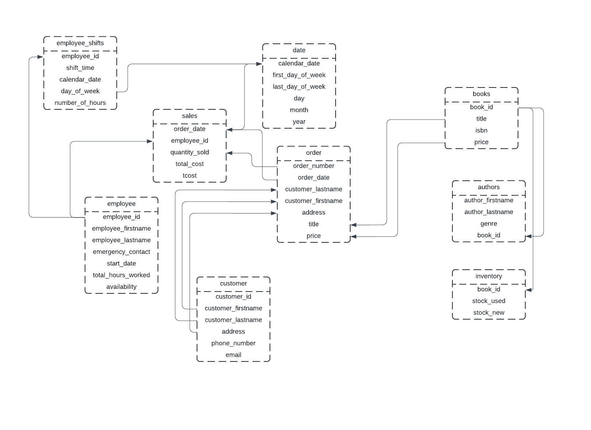

# Assignment 1: Design a Logical Model

## Question 1
Create a logical model for a small bookstore. 📚

At the minimum it should have employee, order, sales, customer, and book entities (tables). Determine sensible column and table design based on what you know about these concepts. Keep it simple, but work out sensible relationships to keep tables reasonably sized. Include a date table. There are several tools online you can use, I'd recommend [_Draw.io_](https://www.drawio.com/) or [_LucidChart_](https://www.lucidchart.com/pages/).


## Question 2
We want to create employee shifts, splitting up the day into morning and evening. Add this to the ERD.




## Question 3
The store wants to keep customer addresses. Propose two architectures for the CUSTOMER_ADDRESS table, one that will retain changes, and another that will overwrite. Which is type 1, which is type 2?

_Hint, search type 1 vs type 2 slowly changing dimensions._

Architecure 1: Type 1 Slowly Changing Dimension - overwrites the existing address with the new address and does not retain history.


Architecture 2: Type 2 Slowly Changing Dimension - adds a new row for the new address and maintains the existing row.


Bonus: Are there privacy implications to this, why or why not?
```
Your answer...
``` a bookstore does not need to retain a history of customers' addresses for working or reporting purposes. Customer addresses are geenrally required for shipping and billing purposes so a current address should suffice. Not maintaining an address history can also help minimse the risk involved to customers in case of a data leakage, as a runnning history of addresses is sensitive and private information. 

## Question 4
Review the AdventureWorks Schema [here](https://imgur.com/a/u0m8fX6)

Highlight at least two differences between it and your ERD. Would you change anything in yours?
```
Your answer...
``` this schema is clearly for a much larger organisation than a small bookstore. This schema has much more detail in it and is very organised. Although there ar emany tables, they are grouped nicely into sub categories for easy perusal.

The employee section in the adventureWorks Schema also contains information on the marital status of employees which should not be relevant and could become grounds for discrimination, so it should be removed. The schema for this assignment does not contain marital status. 

the AdventureWorks schema also stores cutomers credit card information in the CreditCard table, which is a huge risk for information safety and data protection, whereas our schema does not store that information. Unless carefully managed, sensitive information like credit card information can be easily exploited, and that is perhaps best taken care of by a dedicated third party application instead of storing it in the database. 

Our bookstore ERD could use a promotions table where promotion details and dates are stored, and it could also include shelf, bin and modified date entites in the inventory table. 

# Criteria

[Assignment Rubric](./assignment_rubric.md)

# Submission Information

🚨 **Please review our [Assignment Submission Guide](https://github.com/UofT-DSI/onboarding/blob/main/onboarding_documents/submissions.md)** 🚨 for detailed instructions on how to format, branch, and submit your work. Following these guidelines is crucial for your submissions to be evaluated correctly.

### Submission Parameters:
* Submission Due Date: `September 28, 2024`
* The branch name for your repo should be: `model-design`
* What to submit for this assignment:
    * This markdown (design_a_logical_model.md) should be populated.
    * Two Entity-Relationship Diagrams (preferably in a pdf, jpeg, png format).
* What the pull request link should look like for this assignment: `https://github.com/<your_github_username>/sql/pull/<pr_id>`
    * Open a private window in your browser. Copy and paste the link to your pull request into the address bar. Make sure you can see your pull request properly. This helps the technical facilitator and learning support staff review your submission easily.

Checklist:
- [ ] Create a branch called `model-design`.
- [ ] Ensure that the repository is public.
- [ ] Review [the PR description guidelines](https://github.com/UofT-DSI/onboarding/blob/main/onboarding_documents/submissions.md#guidelines-for-pull-request-descriptions) and adhere to them.
- [ ] Verify that the link is accessible in a private browser window.

If you encounter any difficulties or have questions, please don't hesitate to reach out to our team via our Slack at `#cohort-4-help`. Our Technical Facilitators and Learning Support staff are here to help you navigate any challenges.
