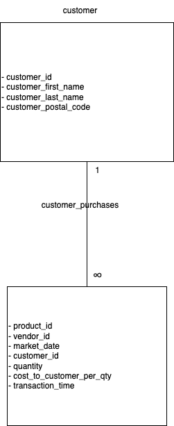

# Homework 1: farmersmarket.db

- Due on Thursday, September 12 at 11:59pm
- Weight: 8% of total grade

## Get to know the farmersmarket.db
Steps to complete this part of the homework:

#### 1) Load Database
- Open DB Browser for SQLite
- Go to File > Open Database
- Navigate to your farmersmarket.db 
	- This will be wherever you cloned the GH Repo (within the **SQL** folder)
	- 

#### 2) Configure your windows
By default, DB Browser for SQLite has three windows, with four tabs in the main window and three tabs in the bottom right window
- Window 1: Main Window (Centre)
	- Stay in the Database Structure tab for now
- Window 2: Edit Database Cell (Top Right)
- Window 3: Remote (Bottom Right)
	- Switch this to DB Schema tab (very bottom)

Your screen should look like this (or very similar)

#### 3) The farmersmarket.db
There are 10 tables in the Main Window:
1) booth
2) customer
3) customer_purchases
4) market_date_info
5) product
6) product_category
7) vendor
8) vendor_booth_assignments
9) vendor_inventory
10) zip_data

Switch to the Browse Data tab, booth is selected by default
  

Using the table drop down at the top left, explore some of the contents of the database

Move on to the Logical Data Model task when you have looked through the tables

## Logical Data Model

Recall during the module:

I diagramed the following four tables:
- product
- product_category
- vendor
- vendor_inventory

Your task: choose two tables and create a logical data model. There are lots of tools you can do this (including drawing this by hand), but I'd recommend [Draw.io](https://www.drawio.com/) or [LucidChart](https://www.lucidchart.com/pages/). 

A logical data model must contain:
- table name
- column names
- relationship type

Please do not pick the exact same tables that I have already diagramed. For example, you shouldn't diagram the relationship between `product` and `product_category`, but you could diagram `product` and `customer_purchases`.

Following is the data model:

**A few hints**:
- You will need to use the Browse Data tab in the main window to figure out the relationship types.
- You can't diagram tables that don't share a common column
	- These are the tables that are connected
	-  
- The column names can be found in a few spots (DB Schema window in the bottom right, the Database Structure tab in the main window by expanding each table entry, at the top of the Browse Data tab in the main window)

