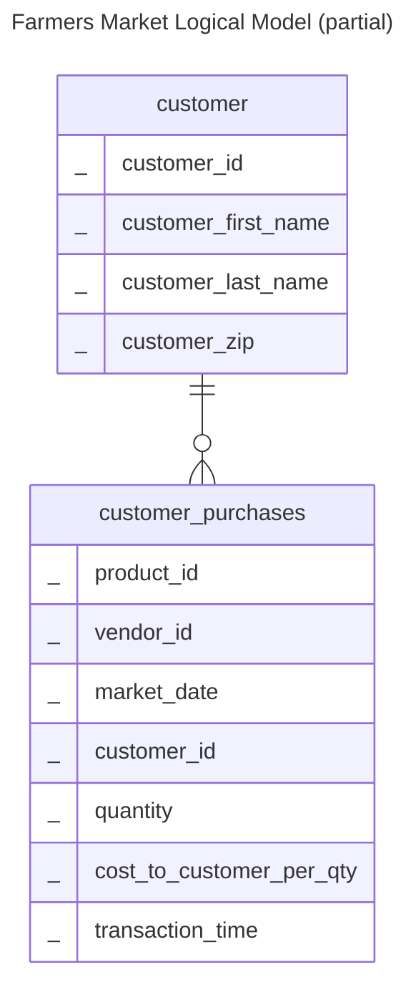

# Homework # 1 - Solution

## Using Mermaid

This diagram was created in Markdown using just words thanks to GitHub's [Mermaid](https://github.com/mermaid-js/mermaid) [support](https://github.blog/developer-skills/github/include-diagrams-markdown-files-mermaid/). 

Using Mermaid in Markdown on GitHub means there is no need to embed an image. Moreover, it's easy to see what changed in the model between versions. You can see the graphical representation on GitHub, or with a Mermaid editor like [Mermaid Live Editor](https://mermaid.live/) or [Mermaid Chart](https://www.mermaidchart.com/).

But if you still want to see an embedded image, go the next [section](#).

## Using an Embedded Image

")
