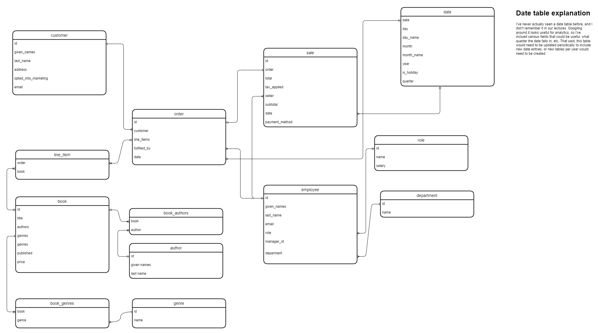
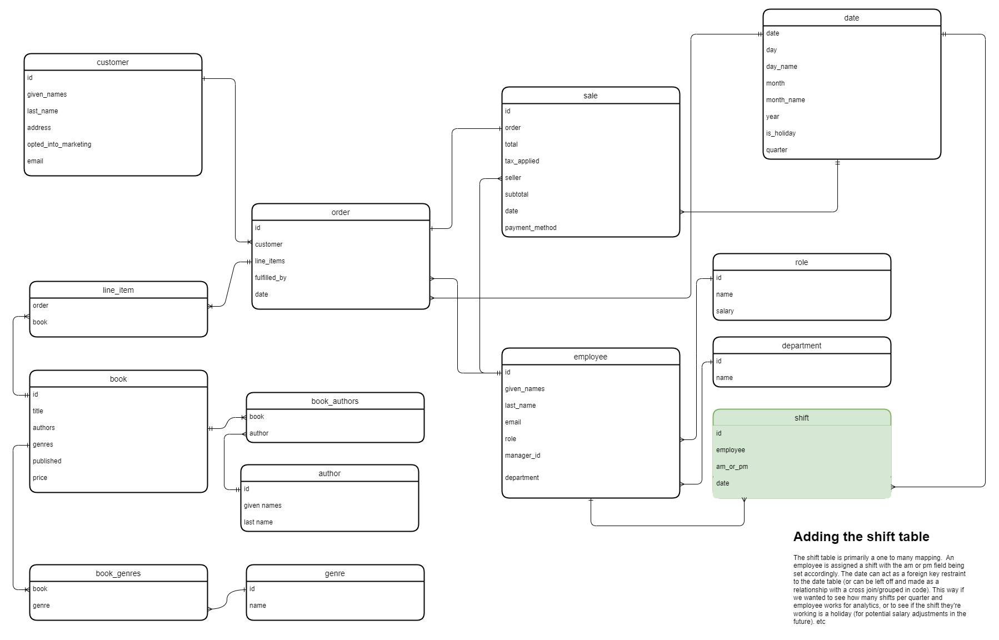
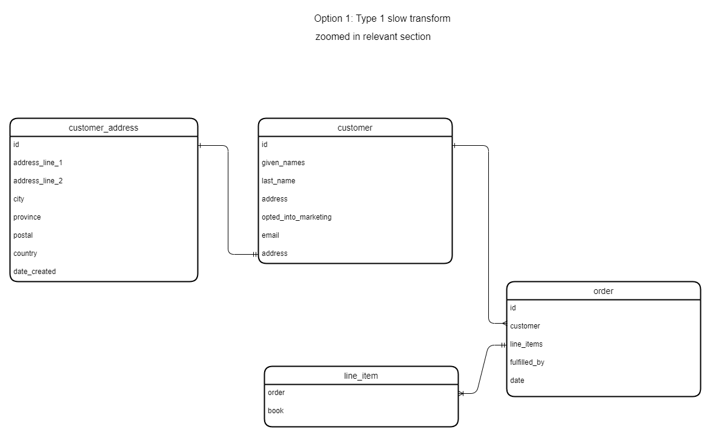
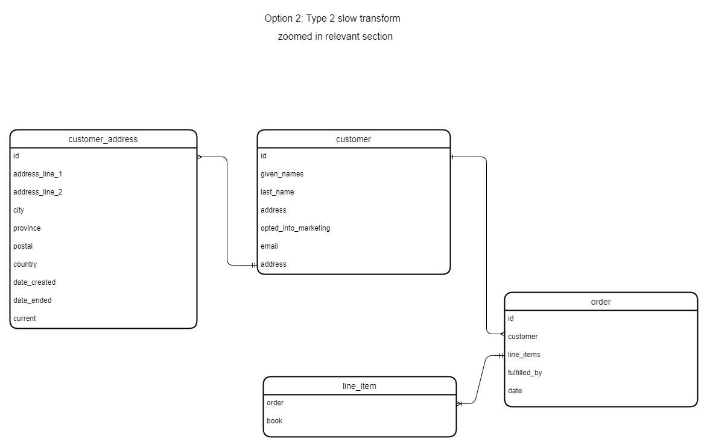

# Assignment 1: Design a Logical Model

## Question 1
Create a logical model for a small bookstore. 📚

At the minimum it should have employee, order, sales, customer, and book entities (tables). Determine sensible column and table design based on what you know about these concepts. Keep it simple, but work out sensible relationships to keep tables reasonably sized. Include a date table. There are several tools online you can use, I'd recommend [_Draw.io_](https://www.drawio.com/) or [_LucidChart_](https://www.lucidchart.com/pages/).

## Question 2
We want to create employee shifts, splitting up the day into morning and evening. Add this to the ERD.

## Question 3
The store wants to keep customer addresses. Propose two architectures for the CUSTOMER_ADDRESS table, one that will retain changes, and another that will overwrite. Which is type 1, which is type 2?

### Option 1: Type One

A type one slowly changing dimension means the record is mutable. As indicated by the line notation, a customer can have 0 or 1 addresses, and an address can have one and _only_ one customer. This means that when updating the address, the record is overwritten with the updated values.

### Option 2: Type Two

A type two slowly dimension preserves history. Instead of Overwriting the existing record, we instead create a new record and update the old one with the appropriate `date_ended` record. This makes the records (effectively) immutable1.
This does mean that logic on the code side must consider an empty date_ended (or the current column) value to be the current address.

### Bonus: Are there privacy implications to this, why or why not?
Short answer: Absolutely.
Longer answer: Storing any type of customer data has a privacy implication. This is a person(s)'s address, and bad things can happen if bad actors see this data. This type of data must be secured properly, and (if you do business in the EU) be scrubbed after a customer requests their account deleted.

With Option 2 specifically, there's an even greater implication. It's an entirely reasonable to believe that a customer changing addresses means they've moved. By storing this information, you're adding another data point to the person. This data in the wrong hands can be used to build a profile of a person. Perhaps correlating them to an old address that they do not wish to be associated with.

**Concrete example**: An abused partner with a common name (say, Jane Smith in North America) has left the province/state to get away from their abuser. If this historical data is published online, the abuser could figure out where they are now by cross-checking the historical addresses to areas they _know_ this Jane Smith lived. Alternatively, If the customer address of type 1 changing dimension is leaked, there would be a far greater variance due to the common name and only one address on record.

That's obviously a pretty extreme example, and there are others that are just as nefarious, if not as violent. Anyway, that's a lot of words for a bonus question. My apologies.

## Question 4
Review the AdventureWorks Schema [here](https://i.stack.imgur.com/LMu4W.gif)

Highlight at least two differences between it and your ERD. Would you change anything in yours?

### Difference 1:
First major difference would be pulling out the concept of a "Person" into its own entity/table. From there it ends up getting referenced customer table, the employee table, and a few other related tables.
My diagram stays far simpler than that, as I keep the customer and employee tables as their own distinct entities.

This is a neat idea though. It gives the opportunity for an employee to act as a customer, but keep their identities linked.

### Difference 2:
The Second difference I see that made me do a double take (and probably shouldn't have) is the amount of additional tables that have been exploded out from the product table.
Yes, the product table still has quite a few columns that are directly related to the table, a large number are foreign key references that are then exploded out into more
tables.

Given that this is a reference schema for Microsoft's OTLP tutorials, it's clear they chose to design the schema to be in the third normal form as closely as possible. Hence all the tables and refrences. 
That's the part that shouldn't surpise me.

### What I would change:
I know that this schema is intended to go to third degree normalization (or as closely as possible, I haven't had to write a schema like that since college). I wouldn't go that far for such a simple example,
but there are things that could be adapted:

* Move emails into their own table
* Improve the order table to include more payment methods. (I was lazy here given that I usually use a stripe ID and a receipt number from stripe at most).
* Pull salesperson into their own table that references the employee.
* include a shopping cart.
* Pull out a product table that is used by the book table so that the book store could sell more than just books.

Basically, more normalization. I don't even think I hit the second form of normalization. I rarely hit third normal form at work due to query performance issues, but this si making me re-consider how I look at databases in general.
# Criteria

[Assignment Rubric](./assignment_rubric.md)

# Submission Information

🚨 **Please review our [Assignment Submission Guide](https://github.com/UofT-DSI/onboarding/blob/main/onboarding_documents/submissions.md)** 🚨 for detailed instructions on how to format, branch, and submit your work. Following these guidelines is crucial for your submissions to be evaluated correctly.

### Submission Parameters:
* Submission Due Date: `June 1, 2024`
* The branch name for your repo should be: `model-design`
* What to submit for this assignment:
    * This markdown (design_a_logical_model.md) should be populated.
    * Two Entity-Relationship Diagrams (preferably in a pdf, jpeg, png format).
* What the pull request link should look like for this assignment: `https://github.com/<your_github_username>/sql/pull/<pr_id>`
    * Open a private window in your browser. Copy and paste the link to your pull request into the address bar. Make sure you can see your pull request properly. This helps the technical facilitator and learning support staff review your submission easily.

Checklist:
- [ ] Create a branch called `model-design`.
- [ ] Ensure that the repository is public.
- [ ] Review [the PR description guidelines](https://github.com/UofT-DSI/onboarding/blob/main/onboarding_documents/submissions.md#guidelines-for-pull-request-descriptions) and adhere to them.
- [ ] Verify that the link is accessible in a private browser window.

If you encounter any difficulties or have questions, please don't hesitate to reach out to our team via our Slack at `#cohort-3-help`. Our Technical Facilitators and Learning Support staff are here to help you navigate any challenges.
