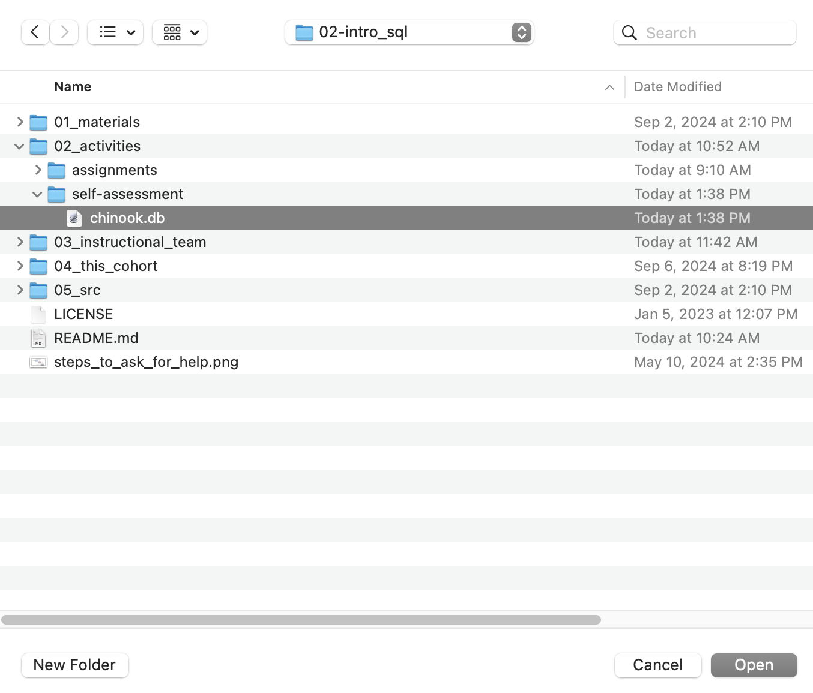
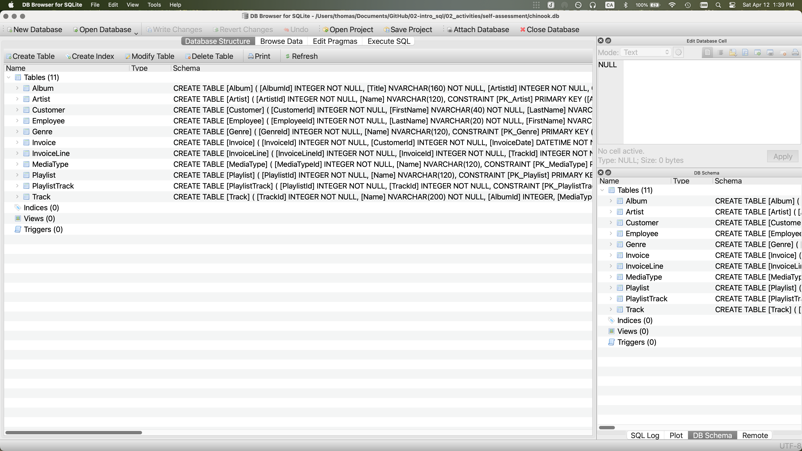
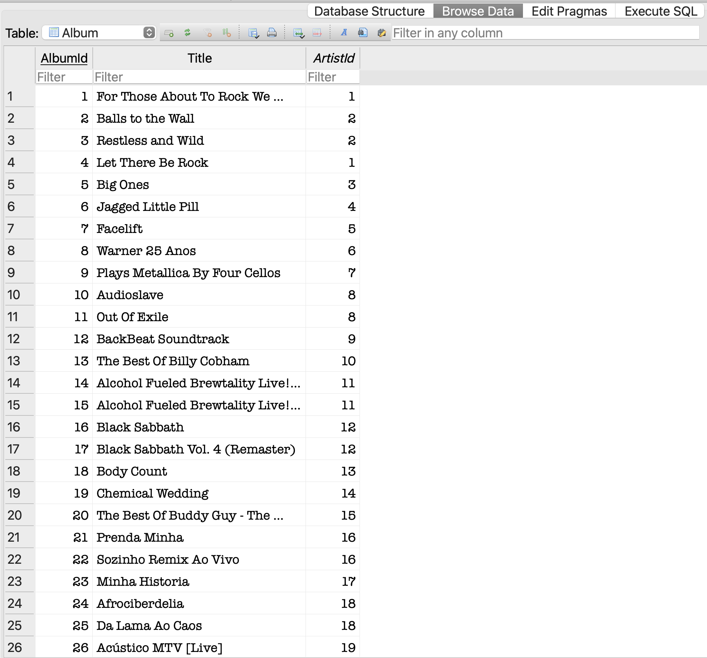
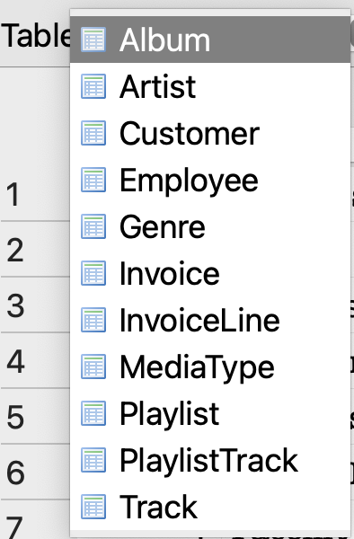
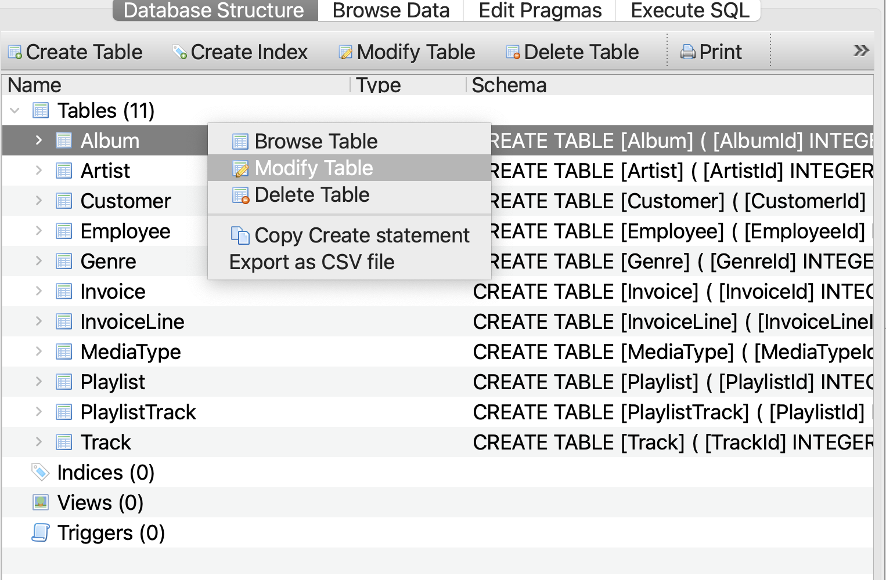

```{r setup, include=FALSE}
library(learnr)
knitr::opts_chunk$set(echo = FALSE)
```
# Self Assessment: Session 1

## Instructions

**Welcome!**

*This app is still very nascent, please alert me to any errors or unexpected behaviour.*

If this is your first time in DB Browser for SQLite, the following instructions may help:

#### 1) Load database
- Open DB Browser for SQLite
- Go to File > Open Database
- Navigate to your chinook.db 
	- This will be wherever you cloned the GH Repo (within the **02_activities/self_assessment** folder)
	- 

#### 2) Configure your windows
By default, DB Browser for SQLite has three windows, with four tabs in the main window and three tabs in the bottom right window

- Window 1: Main Window (centre)
	- Stay in the Database Structure tab for now
- Window 2: Edit Database Cell (top right)
- Window 3: Remote (bottom right)
	- Switch this to DB Schema tab (very bottom)

Your screen should look like this (or very similar)



#### 3) The chinook.db
There are 11 tables in the Main Window:

1. Album
2. Artist
3. Customer
4. Employee
5. Genre
6. Invoice
7. InvoiceLine
8. MediaType
9. Playlist
10. PlaylistTrack
11. Track

Switch to the Browse Data tab, Album is selected by default




Using the table drop down at the top left, explore some of the contents of the database


 
**Click Next Topic when you're ready to begin**

## Getting Acquainted with DB Browser for SQLite

Navigate to the Artist table
```{r db-browser, echo=FALSE}
quiz(
  question("How many rows are in the Artist table?",
    answer("347"),
    answer("2"),
    answer("275", correct = TRUE),
    answer("59")
    ,allow_retry = TRUE
  ),
  question("How many columns are in the Artist table?",
    answer("2", correct = TRUE),
    answer("3"),
    answer("275")
    ,allow_retry = TRUE
  )
)
```

## Data Types

Navigate to the Customer table
```{r data-type, echo=FALSE}
quiz(
  question("What data type is PostalCode?",
    answer("INTEGER"),
    answer("NVARCHAR", correct = TRUE)
    ,allow_retry = TRUE
  ),
  question("For the PostalCode column, which data type would be more restrictive?",
    answer("NVARCHAR"),
    answer("INTEGER", correct = TRUE)
    ,allow_retry = TRUE
    ,correct = "Correct! While some postal codes might be integers for some countries, many contain letters and other characters (spaces, hyphens, etc)."
  )
)
```


## Relationships

```{r relationships, echo=FALSE}
quiz(
  question("What is the relationship between Artist and Album?",
    answer("One-to-One"),
    answer("One-to-Many", correct = TRUE),
    answer("Many-to-Many"),
    answer("These tables have no relationship")
    ,allow_retry = TRUE
  ),
  question("What is the relationship between Customer and Employee?",
    answer("One-to-One"),
    answer("Many-to-One", correct = TRUE),
    answer("Many-to-Many"),
    answer("These tables have no relationship")
    ,allow_retry = TRUE
    ,correct = "Correct! The columns don't need to share names. Not all employees are support representatives, so it's more logical to name the Employee table column 'EmployeeId' rather than 'SupportRepId'"
  ),
  question("What tables are required to see which tracks a customer has purchased? Select every table required.",
    answer("Album"),
    answer("Customer", correct = TRUE),
    answer("Employee"),
    answer("Invoice", correct = TRUE),
    answer("InvoiceLine", correct = TRUE),
    answer("MediaType"),
    answer("Track", correct = TRUE),
    answer("This isn't possible")
    ,allow_retry = TRUE
    ,random_answer_order = TRUE
    ,correct = "Correct! The individual track purchase is stored on the InvoiceLine table, which connects hierarchically to the Invoice table. From the Invoice table, we can reference the customer making the purchase."
  )
)
```

## Primary and Foreign Keys

From the Database Structure tab, you can examine primary and foreign keys by right clicking a table and selecting "Modify Table". Don't actually change anything, but browse the structure.




```{r pks, echo=FALSE}
quiz(
  question("What is the primary key of the Album table?",
    answer("AlbumId",correct = TRUE),
    answer("ArtistId"),
    answer("This table doesn't have a PK"),
    answer("AlbumId and ArtistId")
    ,allow_retry = TRUE
    ,random_answer_order = TRUE
  ),
  question("How many tables use TrackId as a foreign key?",
    answer("2", correct = TRUE),
    answer("3"),
    answer("5")
    ,allow_retry = TRUE
    ,random_answer_order = TRUE
    ,correct = "Correct! InvoiceLine and PlaylistTrack require TrackId as a foreign key. The Track table itself has 3 foreign keys to other tables (Album, Genre, MediaType)."
  ),
  question("Suppose there were no primary or foreign keys at all. If you wanted to delete a Track from the Track table, how many other tables would be affected by such a deletion?",
    answer("1"),
    answer("2", correct = TRUE),
    answer("3"),
    answer("5",),
    answer("11")
    ,allow_retry = TRUE
    ,correct = "Correct! Removing a Track without modifying the InvoiceLine and PlaylistTrack tables would cause those tables' integrity to be affected. This is the reasoning associated with the previous question and why the answers are the same."
  )
)
```

## Commenting Out SQL Code

```{r code-comment, echo=FALSE}
question("How do you comment out code in SQL?",
  answer("`# SELECT...`"),
  answer("`-- SELECT...`", correct = TRUE),
  answer("`/* SELECT... */`", correct = TRUE),
  answer("`// SELECT...`"),
  random_answer_order = TRUE,
  allow_retry = TRUE
)
```

