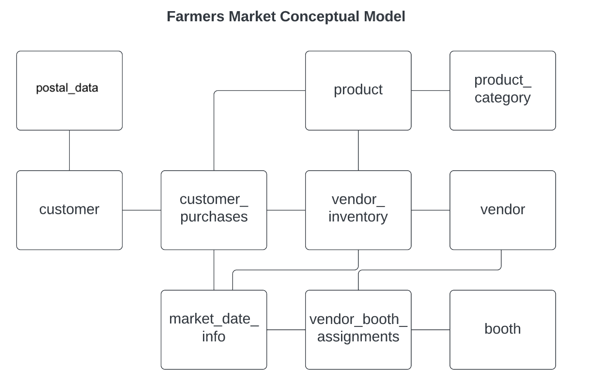
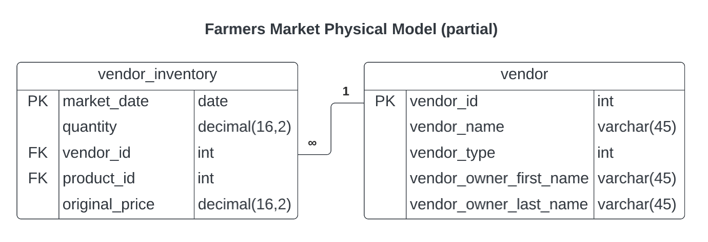

# Introduction to Data Access and Storage

```
$ echo "Data Sciences Institute"
```

---

# Introduction:

## $\rightarrow$ **Welcome**

## What is SQL?

## Data Modelling

---

# Welcome / About Us

---

# About Us (Thomas)

- Started with SQL in first job after graduating
- Data Analyst in US healthcare until moving to Canada in 2018
- Transitioned to Data Engineer at Plan Canada
- Pursued Master of Information at UofT for R and Python focus
- Currently working on AI Governance and Ethics at Dataiku
- **_Have a 4 year old Samoyed named Alto who takes up a lot of my free time 👉_**


---

# About Us (Edward)

- Graduated from the Master of Science in Applied Computing program at UofT
- Currently working as a Research Analyst at the University Health Network
- Will start PhD in Medical Biophysics at UofT in September
- Have worked on creating course material for data science and machine learning at UofT
- Hobbies: Gaming, Crochet, Archery


---

# About Us (Moniz)

- Master in Biomedical Engineering 🎓
- Project and Data Coordinator in Healthcare setting 🏥
- DSI cohort 3 📈
- Hobbies: camping 🏕️ travelling ✈️ and see the world


---

# About Us (Niyaz)

- Master's in Artificial Intelligence with a deep understanding of machine learning algorithms, data science, and advanced computational techniques
- 15 years of experience in software development, database design, and query optimization
- DSI cohort 2
- Co-founder of a company offering web design, SEO, and Google Ads services in Canada
- Experienced mentor and facilitator in product development, focusing on code reviews and Agile practices to ensure quality and continuous improvement
- I always enjoy helping others learn while continuously learning myself


---


# Welcome / Course Content

---

# Course Content

- Data Modelling, Data Structures, Schemas, Basic Data Management, Normal Forms
- Basic SQL Syntax
- Essential SQL Syntax
- Advanced Techniques
- Importing and Exporting Data to and from SQL
- SQL's relationship to the Machine Learning Pipeline
- Data Stewardship, Ethics, and SQL in the Wild

---

# Course Tools

- [DB Browser for SQLite](https://sqlitebrowser.org/dl/): *Where we will write code*
- [GitHub](https://github.com/UofT-DSI/sql): *Module Overview*
- [Etherpad](https://pad.riseup.net/p/SQL_DSI_SGS_Oct2025): *Where we will keep track of session progress*
  - **Visit and complete the sign in prompt at the start every session**
- [SQLite documentation](https://www.sqlite.org/index.html): *For SQL specific questions*
- [DrawIO](https://www.drawio.com/) or [Lucid](https://www.lucidchart.com/pages/): *For Assignments*
- [Code Share](https://codeshare.io/): *To share code during our live coding sessions*
  - This is for convenience only during live coding sessions, use the repo after the session instead
- Mentimeter (links vary): *Small in-class quizzes, easiest to participate on your phone if available, ungraded*

---

# GitHub Repo

[https://github.com/UofT-DSI/sql](https://github.com/UofT-DSI/sql)

- Schedule
- These slides (HTML & PDF)
- Our database for live coding
- All in-class code
- Assignment details and rubrics
- Policies, due dates, etc

---

# 🚨 It is crucial you visit the repo throughout the course, as I may make minor changes and push new content.

---

# Course Content

- This course is an _Introduction_ to SQL
- At the end of the course, I hope you will:
  - Feel comfortable with SQL
  - Know how to search for the right thing on Stack Overflow
  - Read documentation

- We won't cover advanced topics like:
  - Stored Procedures, Triggers, Jobs
  - DBA work (monitoring, server setup, etc)
  - Complex ETL or tooling


---


# Assignments

- Two assignments, released on Monday of each week.
- Broken into three sections:
  - Section 1 focuses on database design
  - Sections 2 and 3 on SQL writing
- Each sections states about when you can start working on the answers
- Review questions/answers in Office Hours course support
- Database design sections are more time consuming
  - Especially Assignment 2. **Do not put this off too much.**
- SQL sections are designed to be relatively easy (with a couple of hard questions)
  - Reaffirms what we wrote together
  - Doing work on your own helps reinforce the learning
- ChatGPT probably won't help you much

---


# Grading 

- Pass/Fail. Do the work, pass the course :) 

- Assignment 1: 30% of mark
- Assignment 2: 70% of mark
- Review rubrics for full details

- Class Attendance: *not graded, come anyways!*
  - Let myself or course support know if you are unable to attend a lesson
  - Code along!! Best way to learn.
---


### What questions do you have about the course?

---

# Welcome / Quick Technical Check

---


# Quick Technical Check

Make sure to install DB Browser for SQLite by our next session.

Installation instructions can be found in your email or [SETUP.md on Github](https://github.com/UofT-DSI/sql/blob/main/SETUP.md)

If you haven't already, please download it here: [https://sqlitebrowser.org/dl//](https://sqlitebrowser.org/dl/). 


For live coding:
- Please download/clone the FarmersMarket.db from our GH repo:
  - [https://github.com/UofT-DSI/sql/blob/main/05_src/sql/farmersmarket.db](https://github.com/UofT-DSI/sql/blob/main/05_src/sql/farmersmarket.db)
- Open it in SQLite with the "Open Database" button and navigate to wherever you have saved it

---


# Quick Technical Check

Check out our [post-installation videos](https://drive.proton.me/urls/SNKJ5KR6TM#A6l8phhXgTHd):
- Changing you DB Browser for SQLite Preferences
- How to Open a Database
- What is the Execute SQL Window
- How to use SQLite Projects

*Did you have Install Issues?*

**If yes, please come to office hours tomorrow before class to resolve**

---

# Introduction:

## Welcome

## $\rightarrow$ **What is SQL?**

## Data Modelling


---

# What is SQL? / SQL

---

# SQL Fundamentals

- SQL: Structured Query Language
  - Pronounced as either S.Q.L. (ess-cue-ell) or “sequel”
- SQL is a _query_ language rather than a programming language
  - Querying is closer to telling a computer *what you want*, rather than *what it has to do*
  - SQL code is often less reproducible than other programming languages because it's domain specific
      - Some SQL code, especially more advanced procedural code, is reproducible within the same flavour
  - SQL's domain is databases and is based on set theory


---

# SQL Fundamentals

- Designed to manage data within Relational Database Management Systems (RDBMs), e.g.
  - MSSQL
  - Oracle DB
  - MySQL/MariaDB
  - PostgreSQL

---

# SQL Formatting

- Like other programming/query languages, SQL has reserved keywords/commands to perform instructional operations 
  - Generally, these keywords are written in all caps: `SELECT`
  - Most modern interpreters no longer require this, but it is the expected standard

- All statements/queries should end with a semicolon
  - A few SQL constructs (like common table expressions, we'll get to these later) require them, otherwise they are optional 
      - I'll almost certainly forget to use them
      - There's some debate over whether or not it's best practice

---


# SQL Formatting

- In SQL, white space and/or line breaks do not matter 
  - Readability is important
    - Try to keep SQL statements to a reasonable screen width
    - Use sensible line breaks
    - Offset subqueries with indents

---

# SQL Formatting

- Code is commented in/out with `--` rather than `#`
- Code blocks can be commented out with `/* */`
  
```
/* 

somecode spanning
multiple lines

*/
```

---

# What is SQL? / Flavours

---

# Flavours
-  RDBMs differ from one to the next:
    - different keywords 
      - e.g. return only 10 rows:
        `SELECT TOP 10...` vs `SELECT ... LIMIT 10`
    - different syntax
      - e.g. not equal: 
      `!=` or `<>` (or both)
    - other, more nuanced/complex differences
      - e.g. architecture, data types, etc

---
# Flavours

- We are using _**SQLite**_:
  - Super easy to get setup
  - Requires almost no overhead
  - Open source, _free_
  - Similar enough in syntax to learn on
  - Used all over the world and in many applications  
      - e.g. Firefox uses a SQLite backend to write a user's history locally
      
---


# Flavours

- Broad observations about Open Source systems:
  - Excellent at what they are designed for
  - Varying data types (SQLite has some unique ones!)
  - Not every command exists, but workarounds are usually possible
  - Some utilize RDBMs that feel extremely outdated


---

# Flavours

- Broad observations about enterprise systems:
  - Powerful and designed to handle edge cases
  - Feel a bit more refined
      - Can be version dependent
  - Tend to "lock in" businesses/organizations
      - Migration is costly, sometimes outrageously so
  - Newer players (Snowflake, Databricks, etc) and cloud providers (Azure, AWS, GCP, etc) offer a lot more functionality than just database querying
      - Sometimes use different terminology to describe SQL tasks 


---


# What is SQL? / Environments for SQL

---


# Databases

- Relational databases are a collection of tables, views, procedural code, and other SQL-assisting artefacts
  - Generally the data stored in a database will be related to a real-world concept
  - Backends to data-collecting systems are often databases
      - e.g. CRMs, EMR software, ERPs, web-based applications
  - Usually not connected to other databases unless deemed necessary
  - Often transactional, meaning data is actively being written to by frontend systems
  - Tables are normalized


---

# Databases

- There are also non-relational databases, often referred to as NoSQL
  - We won't cover these
  - Common tools include: Amazon DynamoDB, Azure CosmosDB, MongoDB, Google Cloud Datastore


---

# Data Warehouses and Data Marts

- Data Warehouses are highly structured collections of (usually tabular) data
  - Data has been processed for a specific purpose, e.g. analytics
  - Data has been centralized
      - Often with the assistance of ETL (Extract, Transform, Load) tools
  - Have a lot of overhead, require governance, and strict rigidity
  - Tables are denormalized
  - Very common for enterprises, but losing traction in many industries


---

# Data Warehouses and Data Marts

- Data Marts are created from Data Warehouses to focus on a single subject 
  - Designed to make Data Warehouses easier to use
  - Data is structured, but flexibility is driven by the purpose of the Data Mart
  - Some denormalized tables may be normalized or undergo even greater normalization
      - _The subject/purpose of the Data Mart might drive these types of decisions_
  - Common for enterprises that have Data Warehouses

---


# Data Lakes and Data Swamps

- Data Lakes allow on-demand access to raw, semi-structured, structured, and unstructured data
  - Not defined by a specific purpose
  - Highly scalable
  - Can be transactional, if systems are designed to produce outputs into Data Lakes
  - Often data sources for machine learning pipelines live in Data Lakes
  - Inexpensive compared to Data Warehouses
  - Increasingly common for enterprises to shift towards Data Lakes, especially with support from newer tools like Snowflake, Databricks, etc, which can maximize the analytical value of a Data Lake


---
# Data Lakes and Data Swamps

- Data Swamps...are poorly governed Data Lakes
  - Lack of documentation, lack of governance, poorly designed Data Lakes become Swamps
  - Avoid building these


---


# What questions do you have?

---


# Introduction:

## Welcome

## What is SQL?

## $\rightarrow$ **Data Modelling**

---


# Data Modelling Topics (its a lot!)

- Relational Database Management Systems

- Data Models

- Structure of Data

- Constraints

- Entity Relationship Diagrams

- Attributes of an ERD: Entities & Relationships

- Relationship Examples

- Conceptual, Logical, Physical Models

- Assignment 1: Design a Logical Model

---

# Relational Database Management Systems

-  Relational Database Management Systems (RDBMs) are software designed to:
  - Store large amounts of data
  - Utilize a query language to allow easy retrieval of the data
  - Allow multiple users to access the data simultaneously
  - Manage permissions for data access
  - Mitigate data corruption and unauthorized access

---

# Relational Database Management Systems

- Generally, data is stored in a _database_
  - A database is a collection of information
  - Within a database, a collection of objects (e.g. tabular data "tables") is stored


---

# Relational Database Management Systems

- RDBMs allow users to define interactions between these objects, such as:
  - Establish the relationship between objects 
  - Define procedural scripts to query specific data or trigger an action
  - Schedule routine work (e.g. procedures to run, maintenance, etc) 

---

# Data Models
- A data model is a notation for describing data or information

- Data models consist of:
  - Structure of the data
  - Operations 
  - Constraints on the data
  - Relationships

---

# Structure of Data

- SQL is comprised of tables

| Breed    | Affectionate w/ Family | Good w/ Other Dogs | Shedding | Coat Type | Coat Length | Playfulness | Energy |
|----------|------------------------|--------------------|----------|-----------|-------------|-------------|--------|
| Pugs     | 5                      | 4                  | 4        | Smooth    | Short       | 5           | 3      |
| Akitas   | 3                      | 1                  | 3        | Double    | Medium      | 3           | 4      |
| Samoyeds | 5                      | 3                  | 3        | Double    | Long        | 5           | 4      |

---

# Structure of Data

- Tables have Attributes and Observations
  - In SQL we call Attributes "Columns"
      - e.g. Breed, Coat Type, Coat Length
  - and Observations "Rows"
      - e.g. Samoyed, Double, Long

- SQL databases require tables to be named
  - e.g. We can call this table "breed_traits"
  
---

# Structure of Data

- Columns are defined (and restricted, i.e. constrained) by data types
- Common ones include:
  - `INT` (integers: 1,2,3,-1,-2,-3)
      - most systems conserve storage space specifying their range 
  - `FLOAT`, `DECIMAL`, `REAL` (decimal: 5.5, 3.333333)
  - `VARCHAR`, `NVARCHAR`, `TEXT` (text strings, with a maximum length associated: 'abc')
  - `DATE`, `DATETIME`, `TIME` (dates and times: '2023-01-09', '11:11:11.000')
- These may vary slightly by flavour (in SQLite they are simpler and less restricted)


---

# Structure of Data

- Data types are important:
  - They affect operation speed, storage size, data validity
      - Speed: it's computationally less expensive to compute smaller values
      - Storage: small is usually better, but the wrong size will affect systems; e.g. Psy's Gangnam Style exceeded 2,147,483,647 (32-bit signed, 2^32/2-1) views, causing YouTube to expand the view counter to 9,223,372,036,854,775,807 (64-bit signed, 2^64/2-1)
      - Validity: ensures columns contain the right type of data for operations, e.g. avoiding 5 + 'ten' = ??
      
---

# Constraints
- Data Models also specify constraints
- Constraints are rules that must be followed:
  - Referential-Integrity constraints
      - Ensure that values in one table have corresponding values in another table
  - Attribute Constraints
      - Ensure that certain types of values are always consistent within columns
      - May also ensure whether values are unique, not missing, etc

---

# Constraints
- **NULL** and **NOT NULL**
  - If a value can be missing or not
- **UNIQUE**
  - All values are different
- **PRIMARY KEY (PK)**
    - Ensures each value in a column is unique within the table (e.g. an ID field)
    - One PK per table
    - Cannot be NULL
    - Ensures database integrity by restricting record deletion

---

# Constraints

- **FOREIGN KEY (FK)**
    - Creates a linkage between a column in one table and a column in another table
        - Generally, foreign keys are linked to primary keys
        - Sometimes share the same name as the linked column, but this isn't required
        - Linkage requires data types to be the same
    - As many FKs as needed per table
    - May be NULL
    - Record can be deleted

---

# Constraints

**Why do we need Primary and Foreign Keys?**
- Formalizing the relationship between PKs and FKs ensures:
  - New records added to tables require a matching value when a relationship exists
      - *orders* are made by *customers* 
      - *orders* refer to *products* that exist
  - Deleted records don't make data elsewhere meaningless
      - *customers* who have had *orders* can't be deleted without deleting the orders first
      - *products* associated with *orders* can't be deleted without deleting the orders first
- The PK-FK relationship can sometimes feel a bit backwards: by establishing an FK we are determining what is allowed to happen!

---

# Constraints

| customer_id (PK) | address            | name |
|---------|--------------------|------|
| 10      | 42 Wallaby Way     | TR   |
| 11      | 221B Baker St      | NN   |
| 12      | 124 Conch St    | JZ   |
| 13      | 4 Privet Dr     | LM   |


| order_id (PK) | customer_id (FK) | product_id (FK) |
|----------|---------|------------|
| 93       | 11      | 123        |
| 94       | 11      | 789        |
| 95       | 13      | 456        |
| 96       | 10      | 101        |

---

# Constraints

| product_id (PK) | name  | price |
|------------|-------|-------|
| 123        | Pen   | 2     |
| 456        | Wand   | 17     |
| 789        | Notepad | 6    |
| 101        | Lamp  | 15    |


---

# Constraints

**Why then do we *require* PKs to be unique** 
- The PK is an identifier for each row
  - Much like how we all have various "ID" numbers to identify us to schools/organizations/governments/etc
  - Some identifying data isn't inherently unique (e.g. name, date of birth) because others can share the same values
- Ensures we are identifying the correct corresponding row of the relationship
  - *This* order was made by *this* customer for *this* product
      - The customer_id in the customer table is unique so that we know exactly which customer made the purchase
      - The product_id in the product table is unique so that we know exactly what was purchased

---

# Constraints

| customer_id (PK) | address            | name |
|---------|--------------------|------|
| 11      | 221B Baker St      | NN   |


| order_id (PK) | customer_id (FK) | product_id (FK) |
|----------|---------|------------|
| 93       | 11      | 123        |
| 94       | 11      | 789        |


| product_id (PK) | name  | price |
|------------|-------|-------|
| 123        | Pen   | 2     |
| 789        | Notepad | 6    |

- The customer_id in the order table does not need to be unique: **Why?**
  - Because a customer can make more than one order

---

# Constraints

**What about *composite* keys?**
- Sometimes no single column in a table is unique
  - In this case, in order to make a PK unique, we build "composite" keys
- Composite keys use a combination of columns to uniquely identify each row
- This can be useful to enforce relationships between two or more attributes
- Quite a few of Farmers Market PKs are composite keys
  - customer_purchases for example uses a composite key on product_id, vendor_id, market_date

---

# Entity Relationship Diagrams

- Entity Relationship Diagrams (ERDs) are diagrams depicting the structure of tables within a database
  - This both _identifies the tables_ and _describes their relationships_ 

- ERDs are useful for:
  - Database design
  - Debugging
  - Writing logical, consistent, and efficient queries


---
# Entity Relationship Diagrams
  
- There are three levels of detail for ERD depictions:
  - Conceptual model
  - Logical model
  - Physical model

---

# Attributes of an ERD Entity

- For a given table:
  - Name
  - Relationship to another table
  - Column Names
  - Column Types
  - Primary Keys (if present)
  - Foreign Keys (if present)

---

# Attributes of an ERD Relationship
- Defines which columns are related
- Defines what type of relationship exists:
  - One-to-One
  - One-to-Many
  - Many-to-Many

---


# Relationship Examples

**One-to-One**: where a given row within a table is associated with only a single row in another table

Table 1: Country — Table 2: Capital City


| Table 1:Country |     | Table 2:Capital |
|-----------------|-----|-----------------|
| Canada          | 1:1 | Ottawa          |
| USA             | 1:1 | Washington DC   |
| Mexico          | 1:1 | Mexico City     |


---


---

# Relationship Examples

**One-to-Many**: where a given row within a table can be referenced by multiple rows in another table

---

# Relationship Examples

Table 1: Country — Table 2: States 

| Table 1:Country |     | Table 2:States    |
|-----------------|-----|-------------------|
| Canada          | 1:∞ | Alberta           |
| Canada          | 1:∞ | British Columbia  |
| Canada          | 1:∞ | ...(11 more rows) |
| USA             | 1:∞ | Alabama           |
| USA             | 1:∞ | Alaska            |
| USA             | 1:∞ | ...(48 more rows) |
| Mexico          | 1:∞ | Aguascalientes    |
| Mexico          | 1:∞ | Baja California   |
| Mexico          | 1:∞ | ...(30 more rows) |

---


---

# Relationship Examples

**Many-to-Many**: where multiple rows within a table can be referenced by multiple rows in another table

For this example, consider different ways to define "European" membership, such as whether or not a country: 1) is a member of the EU, 2) uses the Euro, or 3) has abolished  border controls (Schengen Agreement)


---

Table 1: Country — Table 2: Membership

| Country       | Country ID |
|---------------|------------|
| Slovenia      | 001        |
| Sweden        | 002        |
| Switzerland   | 003        |
| ...(more countries) | ...  |


| Membership | Member ID |
|------------|-----------|
| EU         | 10        |
| Eurozone   | 11        |
| Schengen   | 12        |

---

# Relationship Examples

Table: Different countries align differently within these definition

| Country ID |     | Member ID |
|------------|-----|-----------|
| 001        | ∞:∞ | 10        |
| 001        | ∞:∞ | 11        |
| 001        | ∞:∞ | 12        |
| 002        | ∞:∞ | 10        |
| 002        | ∞:∞ | 12        |
| 003        | ∞:∞ | 12        |

We can create additional Many-to-Many relationships if we created a table including NATO/UN membership, because many non-European countries are NATO/UN members.

---


---


# Conceptual Models

- Define the tables (objects/entities) and their relationships
- Our Farmers Market database: 
  - 10 tables
  - Relationships between these tables
      - e.g. product and product_category: *what type of thing a product is*
      - product and customer_purchases: *what products a customer has bought*
      - product and vendor_inventory: *what products each vendor has available*
  - Not all tables share a relationship to one another, but all tables have at least one relationship

---


     
---


# Logical Models

- Add additional detail to the conceptual model by adding column names for each table
- Often indicate the type of relationship 
  - One-to-One
  - One-to-Many
  - Many-to-Many

---

# Logical Models

- Our (partial) Farmers Market database: 
  - product (5 columns) shares a One-to-Many relationship with vendor_inventory (5 columns) on product_id
  - product_category (2 columns) shares a One-to-Many relationship with product (5 columns) on product_category_id
  - `_______` shares a `_______` relationship with `_______` on vendor_id

---


---

# Physical Models

- Add additional detail to the logical model by adding key type and column data type
- Our (partial) Farmers Market database: 
  - product_category_id (int) is the PK for product_category, which shares a One-to-Many relationship with product on product_category_id (FK)
  
  - product_id (id) is the PK for product

---


---

# Physical Models

- Our (partial) Farmers Market database: 
  - vendor_id (int) is the PK for vendor, which shares a One-to-Many relationship with vendor_inventory on vendor_id (FK)
  - product_id (int) is an FK for vendor_inventory (*so elsewhere in this diagram, we'd connect this to a PK of another table*)
  - vendor_inventory requires a composite key!
      - **why? which columns are required?** 💭💬 **Think, Pair, Share**

---




---

### What questions do you have about Data Modelling?

---

# Assignment 1

---

# Assignment 1, Section 1: Meet the farmersmarket.db

**Prompt 1)**
Choose two tables and create a logical data model. There are lots of tools you can do this (including drawing this by hand), but I'd recommend [Draw.io](https://www.drawio.com/) or [LucidChart](https://www.lucidchart.com/pages/). 

A logical data model must contain:
- table name
- column names
- relationship type

---

# Assignment 1, Section 1: Meet the farmersmarket.db

Please do not pick the exact same tables that I have already diagrammed. For example, you shouldn't diagram the relationship between `product` and `product_category`, but you could diagram `product` and `customer_purchases`.

*HINTS*:
- You will need to use the Browse Data tab in the main window to figure out the relationship types.
- You can't diagram tables that don't share a common column (see conceptual model)
- The column names can be found in a few spots (DB Schema window in the bottom right, the Database Structure tab in the main window by expanding each table entry, at the top of the Browse Data tab in the main window)

---

# Assignment 2

---


#  Assignment 2: Design a Logical Model

**Prompt 1)**Create a logical model for a small bookstore. 📚

At the minimum it should have employee, order, sales, customer, and book entities (tables). Determine sensible column and table design based on what you know about these concepts. Keep it simple, but work out sensible relationships to keep tables reasonably sized. 

Additionally, include a date table. 

There are several tools online you can use, I'd recommend [Draw.io](https://www.drawio.com/) or [LucidChart](https://www.lucidchart.com/pages/).

*HINT:* You do not need to create any data for this prompt. This is a conceptual model only. 

---

#  Assignment 2: Design a Logical Model

**Prompt 2)** We want to create employee shifts, splitting up the day into morning and evening. Add this to the ERD.

---

#  Assignment 2: Design a Logical Model

**Prompt 3)** The store wants to keep customer addresses. Propose two architectures for the CUSTOMER_ADDRESS table, one that will retain changes, and another that will overwrite. Which is type 1, which is type 2? 

*HINT:* search type 1 vs type 2 slowly changing dimensions. 

---


### What questions do you have about anything from today?


