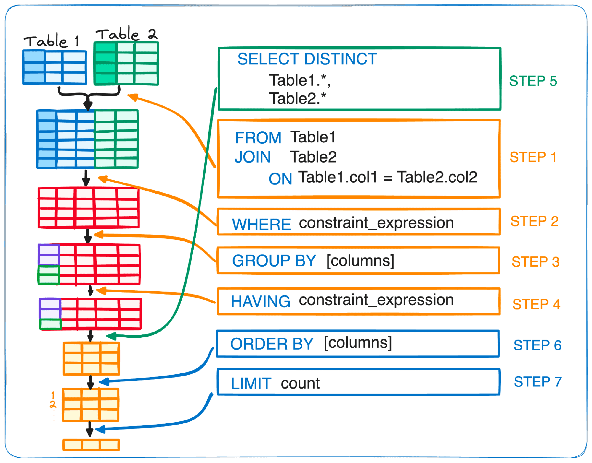

```{r, warning=FALSE, include=FALSE}
library(xaringanthemer)
style_solarized_light(
  
  #colours
  inverse_background_color = "#000000",
  background_color = "#d3d2d9",
  table_row_even_background_color = "#000000",
  code_highlight_color = "#268bd2",

  # fonts
  header_font_google = google_font("Martel", "300", "400"),
  text_font_google = google_font("Lato"),
  code_font_google = google_font("Fira Mono"),
  base_font_size = "18px",
  header_h2_font_size = "2rem" #unique to _03
  )


library(showtext)
```

class: middle, center, inverse
# Essential Techniques:

## Aggregation Functions

## Subqueries

## Temporary Tables & CTEs

## Datetime Functions

---

class: middle, center, inverse
# Essential Techniques:

## **Aggregation Functions**

## Subqueries

## Temporary Tables & CTEs

## Datetime Functions

---

class: middle, center, inverse
# Aggregation Functions

## GROUP BY

## COUNT

## SUM & AVG

## MIN & MAX

## Arithmetic

## HAVING

---

class: middle, center, inverse
# Aggregation Functions

## **GROUP BY**

## COUNT

## SUM & AVG

## MIN & MAX

## Arithmetic

## HAVING

---

class: top, left, inverse
# GROUP BY
- Aggregations generally require a *group*
- `GROUP BY` is mandatory any time a column aside from the one being aggregated is present

--

For example, a query wanting to know the number of days in each month:

```
    SELECT
    COUNT(days)
    ,months

    FROM calendar
    GROUP BY months
```
--

- `GROUP BY` comes after a `WHERE` clause
- Remember: with all aggregation functions, values will be calculated _per group_

---

class: middle, center, inverse
# Aggregation Functions

## GROUP BY

## **COUNT**

## SUM & AVG

## MIN & MAX

## Arithmetic

## HAVING

---

class: top, left, inverse
# COUNT
- `COUNT` performs counts of any given column or set of columns

--

- `COUNT(*)` provides a count of rows in a given table
  - no `GROUP BY` is required here

--

- Multiple counts are treated as separate columns
  - e.g. counting the number of days and months in a year
  
```
    SELECT
    COUNT(days)
    ,COUNT(DISTINCT months)
    ,years

    FROM calendar
    GROUP BY years
```

---

class: top, left, inverse
# COUNT

- When `COUNT` is combined with `DISTINCT`, only unique values are counted
  - `SELECT COUNT(DISTINCT product_id) ...` might produce a different value than `SELECT COUNT(product_id) ...` depending on the context of the table

.pull-left[

.left-column[

| vendor_id | product_id | market_date |
|-----------|------------|-------------|
| 1         | 1          | 2025-01-01  |
| 1         | 1          | 2025-01-02  |
| 1         | 2          | 2025-01-01  |
| 1         | 2          | 2025-01-02  |
| 1         | 2          | 2025-01-03  |
| 1         | 3          | 2025-01-02  |
| 1         | 4          | 2025-01-02  |

]

]

--

.pull_right[

.left-column[

| vendor_id | count_of_distinct_products |
|-----------|----------------------------|
| 1         | 4                          |

<br>

| vendor_id | count_of_products |
|-----------|-------------------|
| 1         | 7                 |

]

]

---

class: top, left, inverse
# COUNT

(`COUNT` live coding)

---

class: middle, center, inverse

# Aggregation Functions

## GROUP BY

## COUNT

## **SUM & AVG**

## MIN & MAX

## Arithmetic

## HAVING

---

class: top, left, inverse
# SUM & AVG

### SUM
- `SUM` performs the sum total of any numeric column
  - Be wary, SQLite may be more permissive for columns with numbers; it's best practice to coerce (`CAST`) these values into numbers before summing to be certain of their validity
    - e.g. `SUM(CAST(column1 AS INTEGER)) AS column1`
  
<br>  
--

- SUM can accommodate multiple columns using the plus `+` operator
  - e.g. `SUM(column1 + column2)`

<br>
--

- Thinking about `SUM` and `COUNT` combined (i.e. a rolling total)? We'll get to that in the next session!

---

class: top, left, inverse
# SUM & AVG

### AVG
- `AVG` performs the average of any numeric column
- Like `SUM`, it can accommodate multiple columns
  - we can also use other mathematical operations for `SUM` and `AVG`, like `-`,`*`,`/`, `%` (i.e. modulo, not percent), etc

---
class: top, left, inverse
# SUM & AVG

### AVG


**Watch out!** Don't average an average column when using `GROUP BY`

.pull-left.w33[
Imagine, `market_avg_temp` stored in the `market_date_info` table:

.pull-left[

| market_day | market_avg_temp |
|------------|-----------------|
| Saturday   | 36              |
| Sunday     | 33              |
| Wednesday  | 25              |
| Saturday   | 28              |
| Sunday     | 31              |
| Wednesday  | 31              |
| Saturday   | 29              |

]

]
--

.pull-left.w33[  
If we `GROUP BY` `market_day`, we can produce an average for each day of the week:

.pull-left[
| market_day | dow_market_avg_temp |
|------------|---------------------|
| Saturday   | 31                  |
| Sunday     | 32                  |
| Wednesday  | 28                  |

]

]
--

.pull-right.w33[
Avoid averaging `dow_market_avg_temp` to get an `overall_market_avg_temp`:

.pull-left[

| actual_avg | avg_of_avgs |
|------------|-------------|
| 30.42857   | 30.33333    |

]
]

---

class: top, left, inverse
# SUM & AVG

(`SUM` & `AVG` live coding)

---

class: middle, center, inverse
# Aggregation Functions

## GROUP BY

## COUNT

## SUM & AVG

## **MIN & MAX**

## Arithmetic

## HAVING

---

class: top, left, inverse
# MIN & MAX

- `MIN` takes the single minimum value of a given column; `MAX` takes the maximum
- Be wary of combining `MIN` & `MAX` with other aggregating functions like `SUM` or `AVG`

- **What do we think happens when `MIN` is performed on a string? Error? Something else? What about `MAX`?**
  
---

class: top, left, inverse
# MIN & MAX

(`MIN` & `MAX` live coding)

---

class: middle, center, inverse
# Aggregation Functions

## GROUP BY

## COUNT

## SUM & AVG

## MIN & MAX

## **Arithmetic**

## HAVING

---

class: top, left, inverse
# Arithmetic

- SQL can perform many basic (and some complex) calculations
  - addition, subtraction, multiplication, division, power, etc
  - geometric/trigonometric functions sin, cos, tan, degrees, radians, etc

<br>
--

- These calculations can also be combined inside aggregation functions
  - e.g. multiplication inside a SUM  `...SUM(quantity * cost)` would create a column like total_spent per group

<br>
--

- SQL is similar to other programming languages in its ability to handle floating point values
- **Because columns are type specific, how would we perform integer division on two numbers?**


---

class: top, left, inverse
# Arithmetic

(Arithmetic live coding)

---

class: middle, center, inverse
# Aggregation Functions

## GROUP BY

## COUNT

## SUM & AVG

## MIN & MAX

## Arithmetic

## **HAVING**

---

class: top, left, inverse
# HAVING
- `WHERE` clauses filter rows _before_ an aggregation occurs
  
  ...so `HAVING` clauses allow us to filter rows _after_ an aggregation is calculated

--
  
- `HAVING` clauses come after `GROUP BY`, but before `ORDER BY`
- `HAVING` clauses only filter aggregated calculations
  - you can have both `WHERE` and `HAVING`
  - they are not interchangeable 

---

class: top, left, inverse
# HAVING

(`HAVING` live coding)

<br>

.center[ 

     
<sup><sup> Image: Joseph Ferrer, KDnuggets </sup></sup>
]

---

class: middle, center, inverse
**Quick Mentimeter**
---

class: middle, center, inverse
**What questions do you have about Aggregations?**

---

class: middle, center, inverse
# Essential Techniques:

## Aggregation Functions

## **Subqueries**

## Temporary Tables & CTEs

## Datetime Functions

---

class: top, left, inverse
# Subqueries

- SQL allows us to query the results of another query
  - We call this a subquery

<br>
--

.pull-left[

- Subqueries can be used in both `JOIN` and `WHERE` clauses
  - In the case of `JOIN` (or `FROM`):
      - you want the subquery to add columns to your output
      - you are using a subquery because you are joining/selecting complex criteria that require manipulation
          - it is often the case that you are joining two or more tables within a subquery to another table

]

.pull-right[


]
---

class: top, left, inverse
# Subqueries

.pull-left[

- Subqueries can be used in both `JOIN` and `WHERE` clauses
  - In the case of `WHERE`:
      - you want to filter results 
      - you are using a subquery because it is simpler than joining and filtering the columns otherwise
      - it's important to note: *you can only return a single column* in your subquery
          - **Why do we think this is?**


]

.pull-right[


]

--

- In a subquery, all columns need to be uniquely named
- Subqueries can usually be run for testing purposes by highlighting them, IDE dependent

---

class: top, left, inverse
# Subqueries

(Subqueries live coding) 

---

class: middle, center, inverse
**SELECT Questions? FROM
    (Questions?)**

---

class: middle, center, inverse
# Essential Techniques:

## Aggregation Functions

## Subqueries

## **Temporary Tables & CTEs**

## Datetime Functions

---

class: middle, center, inverse
# Temporary Tables & CTEs

## Temporary Tables

## CTEs

---

class: middle, center, inverse
# Temporary Tables & CTEs

## **Temporary Tables**

## CTEs

---

class: top, left, inverse
# Temporary ("temp") Tables
- Table objects created on the fly
- Automatically saved to a reserved `temp` schema 

<br>
--

- Accessible across SQL queries in the same session
- Cleared from memory when SQL is closed (or the server connection is terminated)

<br>
--

- Temporary tables can be chained in the same query
  - You can place one temporary table into another
- Must be dropped (deleted from memory) to recreate them with the same name

<br>
--

- Some older versions of SQL don't allow temporary tables
- They are *fantastic placeholders*
  - **What scenarios can we think of where a temporary table would be particularly useful?** `r structure("\U1F4AD", class = "emoji")``r structure("\U1F4AC", class = "emoji")`**Think, Pair, Share**

---

class: top, left, inverse
# Temporary Tables

(Temporary Table live coding)
---

class: middle, center, inverse
# Temporary Tables & CTEs

## Temporary Tables

## **CTEs**

---

class: top, left, inverse
# Common Table Expressions (CTEs)
- Similar to temporary tables
  - CTEs were developed _before_ temp tables
      - Some SQL versions/flavours (especially much older ones) might not support temp tables, so CTEs are an important skill
  
<br>
--

- Instantiated query results created on the fly
  - Utilize the `WITH` command
      - Many RDBMs require a semicolon terminating the `WITH` clause
      - Multiple CTEs don't use more than one `WITH` clause, but rather follow one another with a comma
  - Need to be written _before_ the final `SELECT` statement
 
<br> 
--

- Sometimes easier than a subquery
  - If subqueries become overly complex, they can be harder to read

<br>
--

- Stored in memory
- Limited to your current query window only

---

class: top, left, inverse
# Common Table Expressions (CTEs)

(CTEs live coding)

---

class: middle, center, inverse
**Quick Mentimeter**
---

class: middle, center, inverse
**What questions do you have?**

---

class: middle, center, inverse
# Essential Techniques:

## Aggregation Functions

## Subqueries

## Temporary Tables & CTEs

## **Datetime Functions**

---

class: middle, center, inverse
# Datetime Functions

## Formats

## 'NOW'

## STRFTIME

## Adding Dates

## Difference between Dates

---

class: middle, center, inverse
# Datetime Functions

## **Formats**

## 'NOW'

## STRFTIME

## Adding Dates

## Difference between Dates

---

class: left, upper, inverse
# Formats
- Date formats vary widely in SQL databases
  - A general rule of thumb when working with multiple date fields is to force them all into a similar format 
      - This may seem obvious, but different source systems may write dates different in SQL DBs
- It is not uncommon to store date values as integers YYYYMMDD to increase optimization and decrease storage size

--

<br>

- Manipulating dates varies by flavour
- SQLite is _less_ flexible with dates, requiring all dates to either be:   
  - "YYYY-MM-DD" _strings_
  - Julian Day _fractions_
  - Seconds from Unix Time _integers_

---

class: middle, center, inverse
# Datetime Functions

## Formats

## **'NOW'**

## STRFTIME

## Adding Dates

## Difference between Dates

---

class: left, upper, inverse

# 'NOW' (or GETDATE() or DATE, flavour dependent)
- These functions (there are actually more of them) get the current date and time
  - Some will return UTC time if requested (this can be useful) e.g. `GETUTCDATE()`
- When combined with other Datetime functions, this can serve as a dynamic value
  - e.g. "yesterday", "last year", and so on
- SQLite uses `DATE()`, `DATETIME()`, `TIME()` (without any arguments) _or_ `DATE('now')`

---
class: left, upper, inverse

# 'NOW'

(`'NOW'` live coding)

---

class: middle, center, inverse
# Datetime Functions

## Formats

## 'NOW'

## **STRFTIME**

## Adding Dates

## Difference between Dates

---

class: left, upper, inverse

# STRFTIME
- `STRFTIME` converts DATE and DATETIME values into different formats
- `STRFTIME` also allows you to extract specific "dateparts"
  - e.g. `SELECT STRFTIME('%Y','NOW')`

<br>
--

- The first argument of `STRFTIME` is flexible — you can specify more than one datepart at a time _and_ any formatting
  - e.g. `SELECT STRFTIME('%Y-%m','NOW')` would return 2025-10
  
---
class: left, upper, inverse

# STRFTIME

- `STRFTIME` also allows modification to date dynamically
  - e.g. `SELECT STRFTIME('%Y-%m-%d', '2025-11-11', 'start of month')`
  - **How do we go about subtracting dates rather than adding them?**

<br>
--

- Modifiers include:
  - +/- N years/months/days/hours/minutes/seconds
  - start of year/month/day
  - weekday

<br>
--

- Be mindful: because outcome is a _string_, modification should be done within the `STRFTIME` argument to ensure it is correct
- Some flavours have built in convenience dateparts, like `YEAR`, `MONTH`, etc that make extracting values a bit easier

---
class: left, upper, inverse

# STRFTIME

(`STRFTIME` live coding)

---

class: middle, center, inverse
# Datetime Functions

## Formats

## 'NOW'

## STRFTIME

## **Adding Dates**

## Difference between Dates

---

class: left, upper, inverse
# Adding Dates (sometimes DATEADD or DATE_ADD, flavour dependent)
- SQLite supports two means of adding increments of time to a date:
  - `STRFTIME` as mentioned previously
  - Using `DATE` 
      - e.g. `SELECT DATE('2025-11-11', 'start of month')`
- Both of these methods allow you to chain modifiers
  - e.g. `SELECT DATE('2025-11-11', 'start of month', '-1 day')`

**What do we see as the difference between these?**

--

- This syntax is fairly unique to SQLite, but is conceptually the same, so briefly I will touch on `DATEADD`
  - Generally, we specify a datepart, add/subtract a value, and the date

---

class: middle, center, inverse
# Datetime Functions

## Formats

## 'NOW'

## STRFTIME

## Adding Dates

## **Difference between Dates**

---

class: left, upper, inverse
# Difference between Dates (an extension of STRFTIME or DATEDIFF, flavour dependent)
- The difference between dates can vary in complexity
- We can use `STRFTIME`, subtracting the two dates from one another, using '%s' as our unit
  - e.g. `SELECT (STRFTIME("%s", Date1) - Date2) / {increment, e.g. 3600.0 for hours, 60.0 for minutes, etc}`
      - Be sure to include _.0_ for float precision: `ROUND` or `CAST` to integer if desired
  - `STRFTIME` works well for calculating months and years
      - e.g., months until next total solar eclipse `r structure("\U1F311", class = "emoji")``r structure("\U2600", class = "emoji")` `SELECT STRFTIME('%m','2026-08-12') - STRFTIME('%m','NOW')` 

--

- We can use also use `JULIANDAY`:
  - Julian Days are _fractional_ by nature and result in a difference of days
    - e.g., difference in hours `SELECT CAST((JULIANDAY(Date1) - JULIANDAY(Date2) * 24) AS INT)`

--

- This syntax is also fairly unique to SQLite, but is conceptually the same, so briefly I will touch on `DATEDIFF`
  - Generally, we specify a datepart, startdate, and enddate
  
---

class: left, upper, inverse

# Datetime Functions

(Adding Dates and Difference between Dates live coding)

---


class: middle, center, inverse
**What questions do you have about anything from today?**

```{r echo=FALSE}
#library(renderthis)
#renderthis::to_pdf("~/Documents/GitHub/02-intro_sql/04_this_cohort/custom_slides/markdown/slides_03.Rmd")

##April 2025, Rmd render not working, use html instead
#renderthis::to_pdf("~/Documents/GitHub/02-intro_sql/04_this_cohort/custom_slides/markdown/slides_03.html")
```